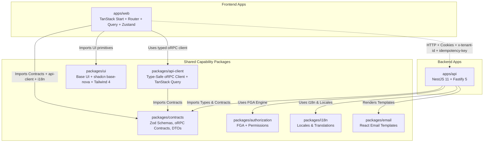
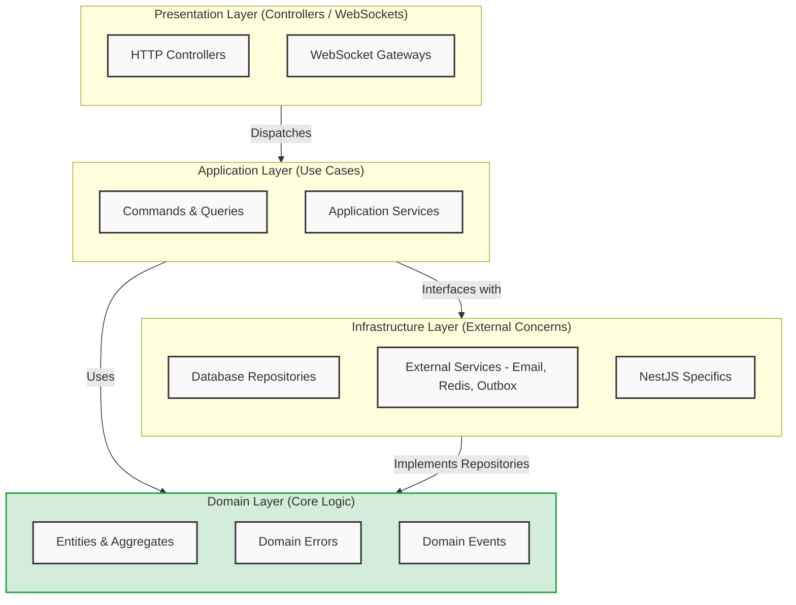
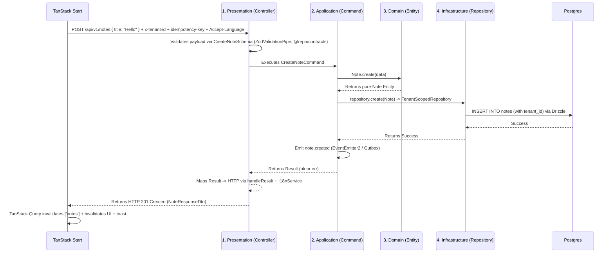

# Architecture Manifesto & Deep Dive

Welcome to the ultimate guide to our codebase. This repository is built upon strict architectural principles designed for massive scale, effortless team collaboration, and extreme maintainability.

Our architecture strictly follows **Modular Monolith**, **Clean Architecture**, **CQRS (Command Query Responsibility Segregation)**, **`neverthrow` Result pattern**, and a fully wired **Shared Contracts** philosophy where the web client and backend speak the exact same type-safe language.

This document will explain **what** we use, **why** we use it, and **how** it all connects perfectly.

---

## 1. The Big Picture (System Map)

Our code is organized as a **Monorepo** using **Turborepo 2.10 + pnpm 10**. The API, web client, and shared capability packages live in one Git repository.

### Why a Monorepo with Shared Contracts?

By sharing capability packages (`@repo/contracts`, `@repo/authorization`, `@repo/i18n`, `@repo/api-client`, `@repo/ui`), **web and backend speak the exact same language**. If the backend changes an API rule or contract, the web compiler catches drift before the code is run.

- oRPC procedures are the canonical runtime API under `/api/v1/rpc`. Web and mobile use `getApiClient()`
  from `@repo/api-client`, which centralizes credentials, refresh, CSRF, tenant, locale, idempotency,
  and typed response DTOs. REST controllers remain a compatibility surface and delegate to the same
  commands and queries.
- UI primitives live once in `@repo/ui` (Base UI + shadcn base-nova + Tailwind 4) and web consumes them via `import { Button } from '@repo/ui/components/button'`.

---

## 2. The Single Source of Truth (`packages/contracts`, `authorization`, `i18n`, `ui`)

This is the most important layer. It holds all the rules for our data and design.

- **Zod Schemas (`@repo/contracts`)**: Rules for what data should look like (`Email must be a string`, `CreateNoteSchema` etc). Also env schemas for `VITE_API_URL` (web) and broader `envSchema` (api).
- **oRPC Contracts (`@repo/contracts`)**: Exact endpoint blueprints (`oc.route().input().output()`)
  used by the canonical OpenAPI transport and generated documentation. REST compatibility routes
  implement the same use cases without duplicating business logic.
- **Permissions & Evaluator (`@repo/authorization`)**: Action vocabulary (`notes:create`, `team:invite`) and pure FGA engine (RBAC + ReBAC + ABAC).
- **Locales (`@repo/i18n`)**: All text shown to users (`en.json` containing `"api.user.notFound": "User not found"`). Consumed via backend `I18nService` and the web `react-i18next` integration.
- **UI System (`@repo/ui`)**: Headless Base UI primitives (`@base-ui/react`) wrapped with `class-variance-authority` + `tailwind-merge` + shadcn base-nova tokens. Single Tailwind entry `src/styles/globals.css` with `@import "tailwindcss"` + design tokens + `@source` for `apps/web` and `packages/ui`. Web imports `import '@repo/ui/globals.css'` once in `routes/__root.tsx`.

### The Rule

We never write validation logic twice. The backend uses these Zod schemas (via `ZodValidationPipe` + `AllExceptionsFilter`) to validate incoming data. The web client uses the same schemas with `react-hook-form` + `zodResolver` (e.g., `LoginSchema`, `CreateNoteSchema`). All user-facing text is pulled from `@repo/i18n` to prevent hardcoded strings. All error messages go through `I18nService.t()` (backend) or `useTranslation().t()` (web).

---

## 3. The Backend Modular Monolith (`apps/api`)

We deploy as a single Node.js process using **NestJS 11** and **Fastify 5**. Internally, our codebase is split into **strictly isolated Modules** (e.g., `users`, `notes`, `tenancy`, `auth`, `files`).

- `auth` does not know how `users` works inside.
- Modules communicate exclusively through Application-layer Commands/Queries or Domain Events.
- **Never** directly import another module's Infrastructure Repository or Drizzle pgTable.

Every domain module strictly separates code into 4 Clean Architecture layers, enforcing the Dependency Rule (inner layers cannot know about outer layers).

### Module Boundaries

### The Request Flow Map

Here is exactly how a request travels through the 4 layers when the web client creates a Note via TanStack Start:

### Layer 1: Presentation Layer (`presentation/`)

- **What it is:** The front door. Controllers and Mappers, protected by `@RequirePermission` (FGA), `@Idempotent`, `@Public`/`@TenantAgnostic`, and `ZodValidationPipe` (from `@repo/contracts` schemas).
- **The Rule:** Controllers are thin. They validate HTTP requests (Zod), call exactly one Application command/query, and map `Result<T,E>` to HTTP via `handleResult` + `I18nService`.
- **Why?** Controllers should _never_ make business decisions. If they do, you can't reuse that logic for a queue worker, cron job, or WebSocket gateway.

### Layer 2: Application Layer (`application/`)

- **What it is:** Orchestrates use cases. Interacts with Repositories (never Drizzle schemas). Emits Domain Events or enqueues via `OutboxService`/`BullMQ`.
- **The Rule:** Strict **CQRS**. We do not use monolithic "God Services". Every use-case is broken down into an isolated class:
  - **Commands:** Mutate state (e.g., `CreateNoteCommand`) -> `Result<T,E>`.
  - **Queries:** Read state without mutating (e.g., `GetUserByIdQuery`) -> `Result<T,E>`.
  - **Listeners:** React to events (`welcome-email.listener`, `notes-realtime.listener`) — idempotent, never throw.
- **Why?** Flat services are globally banned. Isolated commands keep files small, testable, and highly specific (limits in `ai_instructions/CODE_QUALITY_RULES.md`).

### Layer 3: Domain Layer (`domain/`)

- **What it is:** Pure business logic. Entities, Value Objects, Domain Events, Errors.
- **The Rule:** Zero framework dependencies. No NestJS, no Drizzle, no HTTP. Just pure TypeScript classes and `neverthrow` types.
- **Why?** If you change Postgres tomorrow, your business logic should not change. The Domain Layer ensures your business rules are protected.

### Layer 4: Infrastructure Layer (`infrastructure/`)

- **What it is:** Drizzle `pgTable` schemas, Repositories (`BaseRepository`/`TenantScopedRepository`), Redis/BullMQ, Piscina workers, S3/MinIO, Email (Resend/SMTP via CircuitBreaker), Realtime (WS/SSE), Outbox, Audit, Metrics, Tracing.
- **The Rule:** No business logic allowed. `cross-cutting` infra lives in `src/infrastructure/*` (`@Global()`), `domain-specific` infra lives in `modules/[domain]/infrastructure/*`.
- **Why?** The Application layer asks to save data. The Infrastructure layer knows _how_ to save it to Postgres. Repositories map Drizzle rows back into pristine Domain Entities before handing them back. Tenant isolation is app-enforced via `BaseRepository` + `TenantContextService` (CLS `tenantId`) — `findById/updateById/softDelete/delete` are all tenant-scoped.

---

## 4. The Frontend Wiring — TanStack Start (Web)

The web client is **fully wired** to the modular monolith via `@repo/contracts` + `@repo/api-client` + `@repo/i18n`.

### 4.1 Web — TanStack Start (SSR + SPA)

- **Stack:** TanStack Start 1 (Vite 8, TanStack Router 1 file-based, streaming SSR, server functions), TanStack Query 5, Zustand 5 (persist localStorage), react-i18next + i18next-browser-languagedetector, Tailwind CSS 4 + `@repo/ui`, react-hook-form + zodResolver.
- **Entry:** `apps/web/vite.config.ts` => `tanstackStart({ srcDirectory: 'src' }) + viteReact() + tailwindcss() + tsConfigPaths()`. Router defined in `src/router.tsx` via `createRouter({ routeTree, context: { queryClient } })` + `setupRouterSsrQueryIntegration`, reusing the shared `getQueryClient()` singleton (one cache for loaders and components). Routes are thin composers under `src/routes/` (`__root.tsx`, `_app.tsx`, `_app.dashboard.tsx`, `_app.notes.tsx`, `_app.notes.new.tsx`, `_app.users.tsx`, `_app.settings.tsx`, `auth*.tsx`, `accept-invitation.tsx`): each holds `validateSearch`/`beforeLoad`/`loader`/`errorComponent` and renders one feature component. `routeTree.gen.ts` is generated.
- **Contracts:** Forms use `LoginSchema`, `RegisterSchema`, `CreateNoteSchema` directly from `@repo/contracts` via `zodResolver`. No duplicate schemas.
- **API:** `src/lib/api.ts` => `getApiClient()` singleton: `createApiClient(getWebEnv().VITE_API_URL, { getAccessToken: () => useAuthStore.getState().accessToken, getLocale: () => useLocaleStore.getState().locale, getTenantId: () => useTenantStore.getState().tenantId, onAuthRefreshed: (r) => useAuthStore.getState().setAuth(r), onAuthFailure: () => clearAuth + redirect /auth })`. Automatically sends `accept-language`, `x-tenant-id`, `idempotency-key` and 401-refreshes via `requestRefresh`.
- **State:** `src/stores/auth.store.ts` (zustand persist `auth-storage`), `locale.store.ts`, `tenant.store.ts`. Query keys come from `src/lib/query-keys.ts` (always tenant-scoped). Query/mutation helpers live in `src/features/[domain]/` with UI in `components/` subfolders; dates go through `src/lib/format.ts` (`date-fns`, locale-aware).
- **UI:** `@repo/ui` primitives (`Button`, `Card`, `Input`, `Tabs`, `Badge`, `Dialog`, etc) + Tailwind + `ThemeProvider` (light/dark/system, localStorage, `d` toggles). shadcn CLI: `pnpm dlx shadcn@latest add <component> -c apps/web` writes to `packages/ui/src/components/ui`.
- **Env:** `src/lib/env.ts` Zod `VITE_API_URL` from `import.meta.env` (default `http://localhost:3000/api/v1`). Validated, never raw `process.env` beyond that file.
- **i18n:** `src/lib/i18n.tsx` `resources = { en: { translation: locales.en }, es, fr }` + `LanguageDetector`. Keys like `auth.login`, `dashboard.welcome`, `notes.createNote` shared with backend.

### 4.2 The Single UI Source (`packages/ui`)

- **What it is:** Headless Base UI (`@base-ui/react` 1) primitives wrapped with CVA + Tailwind. shadcn base-nova preset, neutral baseColor, cssVariables, lucide icons, Tailwind 4.
- **Exports:** `exports: { "./globals.css": "./src/styles/globals.css", "./lib/*": "./src/lib/*.ts", "./components/*" + "./components/ui/*": "./src/components/ui/*.tsx", "./components/composed/*": "./src/components/composed/*.tsx", "./hooks/*": "./src/hooks/*.ts" }`. `components.json` (RSC true, Tailwind 4).
- **Why?** One place for the design system. Web is `import { Button } from '@repo/ui/components/ui/button'` (or the backward-compatible `@repo/ui/components/button`) + `import '@repo/ui/globals.css'`, with reusable `DataTable`/`PageHeader`/`EmptyState`/`ConfirmDialog` from `@repo/ui/components/composed/*`. Changing a token updates the application globally.
- **Shadcn + Base UI docs:** Follow [`ui.shadcn.com/docs/installation/tanstack`](https://ui.shadcn.com/docs/installation/tanstack) for TanStack Start ( `pnpm dlx shadcn@latest init -t start --preset ...` ) and [`base-ui.com/react/overview/quick-start`](https://base-ui.com/react/overview/quick-start) for headless composition. Components like `button.tsx` (`ButtonPrimitive` from `@base-ui/react/button` + `cva`) and `dialog.tsx` (`DialogPrimitive` + backdrop/portal) are canonical examples.

---

## 5. Handling Errors Gracefully (Railway Oriented Programming)

We **never** `throw new Error()` for expected domain or application errors (like "Email Taken").
Instead, our Application layer returns a `Result<Value, DomainError>` using the **`neverthrow`** library.

### Why?

Thrown exceptions act like hidden GOTO statements that crash apps unexpectedly. They force you to wrap everything in `try/catch`.

### How it works:

1. The Command returns a `Result` box. It either contains `ok(data)` or `err(error)`.
2. The Controller safely unwraps this Result via `handleResult(result, errorMap, i18n, lang)`.
3. If it's an error, it maps the Domain Error to the correct HTTP Status code (e.g., 400 or 404) and translates the error message using `I18nService`.
4. Frontend TanStack Query catches HTTP 401, `getApiClient` auto-refreshes via `/auth/refresh` (httpOnly cookie or short-lived Bearer refresh token), or else clears auth and redirects to `/auth` with translated error via `useTranslation`.
5. Thrown exceptions are reserved exclusively for actual infrastructure crashes (e.g., Database disconnected).

---

## 6. Developer Checklist

When building a new feature (like "Invoices"), follow this flow:

- [ ] **Contracts:** Define the Zod schema and oRPC contract (`oc.route().input().output()`) in `packages/contracts/src/schemas` + `contracts`.
- [ ] **Domain:** Create an `Invoice` pure TypeScript class in `modules/invoices/domain/entities` (no framework deps).
- [ ] **Infrastructure:** Create a Drizzle `pgTable` in `modules/invoices/infrastructure/schemas` and an `InvoicesRepository extends TenantScopedRepository` in `infrastructure/`.
- [ ] **Application:** Create a specific `CreateInvoiceCommand` in `application/commands/` that returns a `Result<T,E>` and dispatches via `OutboxService` if critical.
- [ ] **Presentation:** Create an `InvoicesController` in `presentation/` that validates via `ZodValidationPipe` (schemas from `@repo/contracts`), calls the command, handles the `Result` via `handleResult` + `I18nService`, and maps to HTTP; protect with `@RequirePermission` + `@Idempotent`.
- [ ] **AuthZ:** Add action vocabulary in `packages/authorization/src/permissions.ts` and policies in `application/invoices.policies.ts`, register via `OnModuleInit`.
- [ ] **Text:** Put all user-facing English text inside `packages/i18n/src/locales/en.json` (and `es.json`/`fr.json`), use `I18nService.t()` (api) and `useTranslation().t()` (web).
- [ ] **API Client:** Verify `packages/api-client/src/subclients` and the oRPC client are registered. `pnpm generate:feature invoices invoice` wires both transports automatically.
- [ ] **Web:** Verify generated `_app.invoices.index.tsx`/`_app.invoices.new.tsx`, feature components, `zodResolver`, and query invalidation.
- [ ] **UI:** If a new primitive is needed, add via `pnpm dlx shadcn@latest add <component> -c apps/web` — it lands in `packages/ui`.

---

## Enforcement

The rules defined in `ai_instructions/` are supreme. `pnpm rules:check` runs
dependency-cruiser together with repository convention checks, and CI blocks violations.

Dependency-cruiser enforces that domain code cannot depend on outer layers or NestJS/Drizzle,
controllers cannot import module infrastructure, application code cannot import Drizzle pgTables,
modules cannot import another module's infrastructure or schemas, and dependency cycles fail the build.
Shared contracts and cross-cutting technical services remain intentional, documented exceptions.

Frontend enforces: no `fetch` in routes (must use `getApiClient`), no hardcoded i18n strings, no duplicate Zod schemas (must import from `@repo/contracts`), no `@workspace/ui` imports (must be `@repo/ui`).
