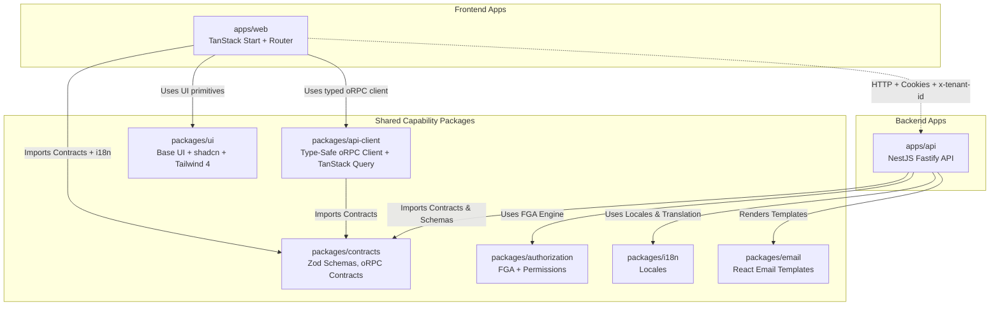
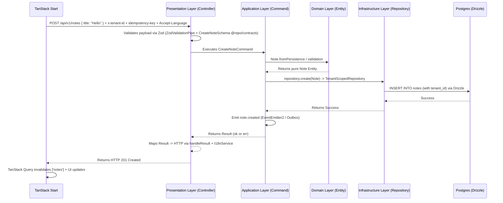

# The Ultimate Guide to Our Architecture

Welcome! If you are new to the project, or if you just want to understand exactly how everything fits together, you are in the right place.

This document explains **everything** in simple English. It uses maps and diagrams so you can visualize the flow of data. By the time you finish reading, you will understand exactly how to build features consistently.

> [!NOTE]  
> **The Core Philosophy:** We build for the long term. We want a codebase where it is impossible to make mistakes. We achieve this by using strict rules, type-safety, and isolating different parts of the code so they don't tangle together.

---

## The Big Picture (System Map)

Before we look at the code, let's look at the big picture. Our code is organized as a **Monorepo** using Turborepo 2.10 + pnpm 10. The API, web client, and shared capability packages live in one Git repository.



### Why a Monorepo with Shared Contracts?

The backend and web share capability packages (`@repo/contracts`, `@repo/authorization`, `@repo/i18n`, `@repo/api-client`, `@repo/ui`). If the backend changes a rule or contract, the web compiler catches drift before the code is run.

- Web is TanStack Start (Vite 8, TanStack Router file-based, streaming SSR) + TanStack Query + Zustand + react-i18next + Tailwind 4 + `@repo/ui` (Base UI + shadcn base-nova). Forms use `react-hook-form` + `zodResolver` + schemas from `@repo/contracts`.
- oRPC procedures are the canonical runtime API under `/api/v1/rpc`. Web and mobile use `getApiClient()`
  from `@repo/api-client`, which centralizes credentials, refresh, CSRF, tenant, locale, idempotency,
  and typed response DTOs. REST controllers remain a compatibility surface and delegate to the same
  commands and queries.

---

## 1. The Single Source of Truth (`packages/contracts`, `authorization`, `i18n`, `ui`)

### What is it?

This is the most important layer in the project. It holds all the rules for our data and design.

### What goes inside?

- **Zod Schemas (`@repo/contracts`)**: Rules for what data should look like (e.g., `Email must be a string`). Also `VITE_API_URL` env validation for web.
- **oRPC Contracts (`@repo/contracts`)**: Exact endpoint blueprints (`oc.route().input().output()`)
  used by the canonical OpenAPI transport and generated documentation. REST compatibility routes
  implement the same use cases without duplicating business logic.
- **Permissions & Evaluator (`@repo/authorization`)**: Central action vocabulary (`notes:create`, `team:invite`) and the pure FGA engine (RBAC + ReBAC + ABAC).
- **Locales (`@repo/i18n`)**: All the text shown to users (`en.json` containing `"api.user.notFound": "User not found"`). Used by backend `I18nService` and the web `react-i18next` integration.
- **UI System (`@repo/ui`)**: Single Tailwind 4 entry `src/styles/globals.css` with design tokens, Base UI headless primitives, shadcn base-nova preset, lucide icons. Web imports `@repo/ui/globals.css` once.

### Why do we need it?

To prevent repeating ourselves. The backend uses the Zod schemas (via `ZodValidationPipe`) to validate incoming API data. The web uses the same schemas via `zodResolver` for instant client-side validation + type-safe API calls via `@repo/api-client`. No duplicate forms, no drift.

---

## 2. The Backend (`apps/api`)

Our backend uses **NestJS 11** and **Fastify 5**. But we don't just throw code into controllers. We use a pattern called **Clean Architecture** combined with **CQRS** (Command Query Responsibility Segregation).

This means we divide our code into strict layers, like an onion.

### The Request Flow Map — Frontend to Backend

Here is exactly how a request travels when a TanStack Start page creates a Note:



Now, let's explain each of those layers in simple English.

---

### Layer A: The Presentation Layer (`presentation/`)

**What it is:** The front door of the backend. It contains Controllers (`notes.controller.ts`).
**The Rule:** Controllers are thin.
**Why?** Controllers should only care about HTTP (Status codes like 200 or 404, parsing headers, reading the body). They should _never_ make business decisions.
**How to use it:**

- Read the incoming request (validated via `ZodValidationPipe` with `@repo/contracts` schema).
- Pass the data to the Application Layer (`CreateNoteCommand`).
- Get the `Result` back.
- If it succeeded, send a 200/201 OK. If it failed, send a 400 or 404 with a translated error message using `I18nService`.

### Layer B: The Application Layer (`application/`)

**What it is:** The brain. It contains Commands and Queries.
**The Rule:** Strict CQRS (Command Query Responsibility Segregation).
**Why?** Instead of having one massive service file that is 5,000 lines long, we split every single action into its own file.

- Writing data? It goes in a **Command** (e.g., `CreateNoteCommand`).
- Reading data? It goes in a **Query** (e.g., `GetNotesQuery`).
- **We never throw errors** (`throw new Error`). Throwing errors crashes apps.
- Instead, we use a library called `neverthrow`. Every Command returns a `Result`. It either returns `ok(data)` or `err(error)`. The Controller checks which one it is.

### Layer C: The Domain Layer (`domain/`)

**What it is:** The absolute core of the business. It contains Entities (like `Note`).
**The Rule:** No outside tools allowed. No database code, no HTTP code, no framework code. Just pure TypeScript.
**Why?** If you change your database tomorrow, your business logic should not change. The Domain Layer ensures your business rules are protected.

### Layer D: The Infrastructure Layer (`infrastructure/`)

**What it is:** It talks to Postgres (Drizzle), Redis, BullMQ, S3/MinIO, and external APIs.
**The Rule:** No business logic allowed.
**Why?** The Application Layer doesn't know _how_ to save a Note to Postgres. It just asks the Infrastructure Layer to do it.
**How to use it:**

- This is where we write our Drizzle `pgTable` schemas (`infrastructure/schemas/*.schema.ts`).
- We create Repositories (like `NotesRepository`) that extend `BaseRepository` or `TenantScopedRepository`.
- **The Magic Trick:** When the Repository fetches a row from Postgres, it is a raw `NoteRow`. Before giving it back to the Application Layer, the Repository uses `toDomain()` to convert it back into a pure, clean Domain Entity. All tenant-scoped reads/writes are filtered by `TenantContextService` (CLS `tenantId`) — `findById/updateById/softDelete/delete` all enforce tenant isolation.

---

## 3. The Frontend — Web (Fully Wired)

### Web — TanStack Start

Our web app lives in `apps/web` and is a **TanStack Start** app (the most modern full-stack React framework in 2026).

- **Vite config:** `vite.config.ts` with `tanstackStart({ srcDirectory: 'src' }) + viteReact() + tailwindcss() + tsConfigPaths()`. Port 5155.
- **Router:** `src/router.tsx` creates the router with `createRouter({ routeTree, context: { queryClient } })` + `setupRouterSsrQueryIntegration`, reusing the shared `getQueryClient()` singleton. Routes are thin composers under `src/routes/` (`__root.tsx` with html + providers + `Toaster` + globals.css, `_app.tsx` session bootstrap + guards, `_app.dashboard.tsx`, `_app.notes.index.tsx`, `_app.notes.new.tsx`, `_app.notes.$noteId.tsx`, `_app.notifications.tsx`, `_app.users.tsx`, `_app.settings.tsx`, `auth*.tsx`, `accept-invitation.tsx`): each holds `validateSearch`/`beforeLoad`/`loader`/`errorComponent` and renders one feature component from `src/features/[domain]/components/`.
- **Shadcn + Base UI:** `components.json` (RSC true, style base-nova, Tailwind 4, aliases). Primitives in `packages/ui/src/components/ui/*.tsx` are Base UI primitives (`ButtonPrimitive` from `@base-ui/react/button` + `cva`) — add more via `pnpm dlx shadcn@latest add <component> -c apps/web` (lands in `components/ui/`). Import them as `import { Button } from '@repo/ui/components/ui/button'`; reusable `DataTable`/`PageHeader`/`EmptyState`/`ConfirmDialog` come from `@repo/ui/components/composed/*`.
- **Tailwind:** Single `packages/ui/src/styles/globals.css` with `@import "tailwindcss"` + tokens. Web imports `import '@repo/ui/globals.css'` once in `__root.tsx`.
- **State:** `src/stores/auth.store.ts` (zustand; access/refresh tokens memory-only, only the user profile persists), `locale.store.ts`, `tenant.store.ts`. Server state via TanStack Query (`src/features/notes/notes.queries.ts`); query keys are tenant-scoped for notes/users/files and user-scoped for privacy/notifications.
- **API:** `src/lib/api.ts` => `getApiClient()` wraps `createApiClient(VITE_API_URL, { getAccessToken, getLocale, getTenantId, onAuthRefreshed/onAuthFailure })`. Env validated in `src/lib/env.ts` (`VITE_API_URL` Zod).
- **i18n:** `src/lib/i18n.tsx` with `resources` from `@repo/i18n` + `LanguageDetector` (localStorage). Every string via `const { t } = useTranslation()` and `t('auth.login')`.

### Why this frontend wiring is reliable

- **No duplication:** Zod schemas live once in `@repo/contracts`, consumed by api (`ZodValidationPipe`) and web (`react-hook-form zodResolver`).
- **No drift:** REST DTOs and Zod schemas are shared. Changing a route payload is a compile error in the API client and web.
- **One auth story:** Bearer access/refresh tokens held memory-only on web (only the profile persists) and in SecureStore on mobile, through the same `getApiClient` refresh + `x-tenant-id` + `idempotency-key` logic.
- **One i18n story:** locales in `@repo/i18n`, consumed by web and mobile through `react-i18next` (mobile seeds the device locale via `expo-localization`).
- **One notification story:** modules emit domain events; the notifications module fans out (see `docs/NOTIFICATIONS.md`). Files upload-then-attach (see `docs/FILE_UPLOADS.md`); GDPR export/erasure lives in privacy (see `docs/PRIVACY.md`); orgs/invitations are tenant-scoped (see `docs/TENANCY.md`).

---

## 4. Handling Errors Gracefully (The `neverthrow` Rule)

In most apps, when something goes wrong, developers write `throw new Error("Something bad happened")`.

> [!WARNING]  
> **We never use `throw` in our Application or Domain layers.**

### Why?

When you throw an error, it acts like an unpredictable break that crashes the process.

### Our Solution: Results

Instead of throwing, our functions return a `Result` box. The box either contains a success (`ok`) or a failure (`err`).

```typescript
// Inside the Command
if (noteAlreadyExists) {
  return err({ type: "NOTE_EXISTS" }); // Safe!
}
return ok(newNote); // Safe!
```

```typescript
// Inside the Controller
const result = await command.execute(data);
if (result.isErr()) {
  return handleResult(
    result,
    { NOTE_NOT_FOUND: { status: 404, i18nKey: "api.note.notFound" } },
    i18n,
    lang,
  );
}
return toNoteResponse(result.value);

// Frontend (TanStack Query)
// 401 -> getApiClient auto-refreshes, else redirects to /auth via useTranslation error key
```

---

## 5. Summary Checklists for Developers

If you are asked to build a new feature (like "Invoices"), use this simple checklist:

- [ ] **Contracts:** Did I create the Zod schema and oRPC contract (`oc.route().input().output()`) in `packages/contracts`?
- [ ] **Domain:** Did I create an `Invoice` pure TypeScript class in `modules/invoices/domain/entities`?
- [ ] **Infrastructure:** Did I create a Drizzle `pgTable` and an `InvoicesRepository extends TenantScopedRepository` in `infrastructure/`?
- [ ] **Application:** Did I create a specific `CreateInvoiceCommand` in `application/commands/` that returns a `Result` and uses `OutboxService` if the event is critical?
- [ ] **Presentation:** Did I create an `InvoicesController` that validates via `ZodValidationPipe` (schemas from `@repo/contracts`), calls the command, maps the `Result` via `handleResult` + `I18nService`, and is protected by `@RequirePermission` + `@Idempotent`?
- [ ] **AuthZ:** Did I add the action to `packages/authorization/src/permissions.ts` and policies in `application/invoices.policies.ts` (`OnModuleInit` register)?
- [ ] **Text:** Did I put all the English text inside `packages/i18n/src/locales/en.json` (and `es.json`/`fr.json`)? Then use `I18nService.t()` (api) and `useTranslation().t()` (web).
- [ ] **API Client:** Did I verify the generated `createInvoicesClient` registration and oRPC contract entry? Tip: `pnpm generate:feature invoices invoice` wires the slice.
- [ ] **Web:** Did I add `apps/web/src/routes/_app.invoices.index.tsx` (+ `.new.tsx` for create) + `apps/web/src/features/invoices/invoices.queries.ts` (queryOptions) + form with `zodResolver` + `@repo/ui` + `getApiClient()` + invalidate?
- [ ] **Mobile:** Did I add the expo-router screen + `apps/mobile/src/features/invoices/` queries/mutations mirroring web, using `src/components/ui/` mirrors (never `@repo/ui`)?
- [ ] **Notify:** If the feature has meaningful state changes, did I emit a domain event and add the fan-out handler + `NOTIFICATION_TYPES` entry + i18n titles (never send from the module)?
- [ ] **Migrations:** Did schema changes ship a Drizzle migration (pre-production folded into `migrations/pg/0000_initial.sql`, `db:migrate:check` green)?
- [ ] **UI:** If a new primitive was needed, did I add via `pnpm dlx shadcn@latest add <component> -c apps/web`?

If you checked all those boxes, you have written **perfect, clean, enterprise-grade code**. Welcome to the team!
