# Production Architecture Baseline

This repository is a modular monolith with one deployable API and one web client. `TENANCY_MODE` is selected at deployment time as `single` or `multi`; client requests cannot change it.

## High-Level System Architecture

```mermaid
flowchart TD

subgraph group_clients["Client Apps"]
  node_web["Web Client<br/>[query-client.tsx]"]
  node_mobile["Mobile Client<br/>[query-client.tsx]"]
end

subgraph group_domains["Domain Modules"]
  node_auth["Auth API<br/>[auth.controller.ts]"]
  node_tenancy["Tenancy API<br/>[organizations.controller.ts]"]
  node_notes["Notes API (Example)<br/>[notes.controller.ts]"]
  node_note_events["Notes Events<br/>[notes-realtime.listener.ts]"]
  node_files["Files API<br/>[files.controller.ts]"]
  node_notifications["Notifications API<br/>[notifications.controller.ts]"]
  node_privacy["Privacy API<br/>[privacy.controller.ts]"]
  node_notification_worker["Delivery Worker<br/>[notification-delivery.worker.ts]"]
end

subgraph group_platform["Platform Services"]
  node_api["API Runtime<br/>[main.ts]"]
  node_sessions["Session Service<br/>[session.service.ts]"]
  node_authorization["Authorization<br/>[authorization.service.ts]"]
  node_realtime["Realtime Service<br/>[realtime.service.ts]"]
  node_sse["SSE Transport<br/>[realtime-sse.controller.ts]"]
  node_storage["Storage Service<br/>[storage.service.ts]"]
  node_queue["Job Queue<br/>[queue.service.ts]"]
  node_email["Email Service<br/>[email.service.ts]"]
  node_metrics["Metrics Service<br/>[metrics.service.ts]"]
end

subgraph group_external["External Systems"]
  node_postgres[("PostgreSQL")]
  node_redis[("Redis")]
  node_object_storage[("Object Storage (S3/MinIO)")]
  node_email_provider["Email Provider (SMTP/Resend)"]
  node_observability["Observability (OTEL/Prometheus)"]
end

node_user(("User"))

node_user -->|"uses"| node_web
node_user -->|"uses"| node_mobile
node_web -->|"requests"| node_api
node_mobile -->|"requests"| node_api
node_api -->|"dispatches"| node_auth
node_api -->|"dispatches"| node_tenancy
node_api -->|"dispatches"| node_notes
node_api -->|"dispatches"| node_files
node_api -->|"dispatches"| node_notifications
node_api -->|"dispatches"| node_privacy
node_api -->|"checks"| node_authorization
node_auth -->|"manages sessions"| node_sessions
node_sessions -->|"stores sessions"| node_redis
node_tenancy -->|"checks access"| node_authorization
node_notes -->|"reads and writes"| node_postgres
node_notes -->|"emits events"| node_note_events
node_note_events -->|"publishes updates"| node_realtime
node_realtime -->|"stores streams"| node_redis
node_realtime -->|"streams events"| node_sse
node_sse -.->|"pushes events to"| node_web
node_sse -.->|"pushes events to"| node_mobile
node_files -->|"reads and writes"| node_postgres
node_files -->|"manages objects"| node_storage
node_storage -->|"transfers objects"| node_object_storage
node_notifications -->|"enqueues delivery"| node_queue
node_queue -->|"persists jobs"| node_redis
node_queue -->|"dispatches jobs"| node_notification_worker
node_notification_worker -->|"requests delivery"| node_email
node_email -.->|"sends email"| node_email_provider
node_privacy -->|"reads and writes"| node_postgres
node_api -->|"records metrics"| node_metrics
node_metrics -.->|"exports telemetry"| node_observability

click node_web "https://github.com/ihssmaheel-dev/modular-monolith-starter/blob/main/apps/web/src/lib/query-client.tsx" _blank
click node_mobile "https://github.com/ihssmaheel-dev/modular-monolith-starter/blob/main/apps/mobile/src/lib/query-client.tsx" _blank
click node_api "https://github.com/ihssmaheel-dev/modular-monolith-starter/blob/main/apps/api/src/main.ts" _blank
click node_auth "https://github.com/ihssmaheel-dev/modular-monolith-starter/blob/main/apps/api/src/modules/auth/presentation/controllers/auth.controller.ts" _blank
click node_sessions "https://github.com/ihssmaheel-dev/modular-monolith-starter/blob/main/apps/api/src/infrastructure/session/session.service.ts" _blank
click node_tenancy "https://github.com/ihssmaheel-dev/modular-monolith-starter/blob/main/apps/api/src/modules/tenancy/presentation/controllers/organizations.controller.ts" _blank
click node_authorization "https://github.com/ihssmaheel-dev/modular-monolith-starter/blob/main/apps/api/src/infrastructure/authorization/authorization.service.ts" _blank
click node_notes "https://github.com/ihssmaheel-dev/modular-monolith-starter/blob/main/apps/api/src/modules/notes/presentation/controllers/notes.controller.ts" _blank
click node_note_events "https://github.com/ihssmaheel-dev/modular-monolith-starter/blob/main/apps/api/src/modules/notes/application/listeners/notes-realtime.listener.ts" _blank
click node_files "https://github.com/ihssmaheel-dev/modular-monolith-starter/blob/main/apps/api/src/modules/files/presentation/controllers/files.controller.ts" _blank
click node_notifications "https://github.com/ihssmaheel-dev/modular-monolith-starter/blob/main/apps/api/src/modules/notifications/presentation/controllers/notifications.controller.ts" _blank
click node_privacy "https://github.com/ihssmaheel-dev/modular-monolith-starter/blob/main/apps/api/src/modules/privacy/presentation/controllers/privacy.controller.ts" _blank
click node_realtime "https://github.com/ihssmaheel-dev/modular-monolith-starter/blob/main/apps/api/src/infrastructure/realtime/realtime.service.ts" _blank
click node_sse "https://github.com/ihssmaheel-dev/modular-monolith-starter/blob/main/apps/api/src/infrastructure/realtime/transports/realtime-sse.controller.ts" _blank
click node_storage "https://github.com/ihssmaheel-dev/modular-monolith-starter/blob/main/apps/api/src/infrastructure/storage/storage.service.ts" _blank
click node_queue "https://github.com/ihssmaheel-dev/modular-monolith-starter/blob/main/apps/api/src/infrastructure/queue/queue.service.ts" _blank
click node_notification_worker "https://github.com/ihssmaheel-dev/modular-monolith-starter/blob/main/apps/api/src/modules/notifications/application/workers/notification-delivery.worker.ts" _blank
click node_email "https://github.com/ihssmaheel-dev/modular-monolith-starter/blob/main/apps/api/src/infrastructure/email/email.service.ts" _blank
click node_metrics "https://github.com/ihssmaheel-dev/modular-monolith-starter/blob/main/apps/api/src/infrastructure/metrics/metrics.service.ts" _blank

classDef toneNeutral fill:#f8fafc,stroke:#334155,stroke-width:1.5px,color:#0f172a
classDef toneBlue fill:#dbeafe,stroke:#2563eb,stroke-width:1.5px,color:#172554
classDef toneAmber fill:#fef3c7,stroke:#d97706,stroke-width:1.5px,color:#78350f
classDef toneMint fill:#dcfce7,stroke:#16a34a,stroke-width:1.5px,color:#14532d
classDef toneRose fill:#ffe4e6,stroke:#e11d48,stroke-width:1.5px,color:#881337
classDef toneIndigo fill:#e0e7ff,stroke:#4f46e5,stroke-width:1.5px,color:#312e81
classDef toneTeal fill:#ccfbf1,stroke:#0f766e,stroke-width:1.5px,color:#134e4a
class node_web,node_mobile,node_user toneBlue
class node_auth,node_tenancy,node_notes,node_note_events,node_files,node_notifications,node_privacy,node_notification_worker toneAmber
class node_api,node_sessions,node_authorization,node_realtime,node_sse,node_storage,node_queue,node_email,node_metrics toneMint
class node_postgres,node_redis,node_object_storage,node_email_provider,node_observability toneRose
```



## API and contracts

`@repo/contracts` is the schema source of truth and the oRPC contract registry. The Nest
`@orpc/nest` adapter serves the contracts as the runtime transport at `/api/v1/rpc/*`; the typed
`@repo/api-client` uses this transport by default. Compatibility REST controllers remain at
`/api/v1/*` and call the same application commands/queries. A route is complete only when its
contract, oRPC handler, REST compatibility mapping (where required), and transport parity smoke
test are present.

### oRPC request flow

```text
oRPC client → OpenAPI link → Nest @orpc/nest adapter → guards/interceptors
  → contract validation → application command/query → repository → database/outbox/audit
```

`v1` is the stable public API surface. Contracts and module controllers are version-neutral; a
breaking API change creates a new transport version without modifying the previous version's
contract. API documentation remains at `/api/docs`, the application serves health checks at `/api/v1/health/*` (NGINX aliases `/health/*`), and
metrics use `/metrics`.

Authentication, tenant, locale, CSRF, and idempotency headers are injected by the shared client;
the same global Nest security pipeline protects both transports. oRPC errors use the stable API
error code and localized message envelope, while the REST surface remains a compatibility option
without a second business implementation.

### Response and error contracts

Every REST controller method is decorated with the exact output schema used by its oRPC
procedure. A global response interceptor parses the returned value at the HTTP boundary; contract
violations become a safe 500 response and are logged with the request ID. oRPC's implementation
interceptor performs the equivalent output validation for RPC calls. The parity suite fails when a
route is missing a shared schema or its REST/oRPC method, path, or status diverges.

All failures use `ApiErrorEnvelopeSchema`:

```json
{
  "code": "VALIDATION_FAILED",
  "i18nKey": "api.error.validationFailed",
  "message": "Validation failed",
  "status": 400,
  "requestId": "request-id",
  "fieldErrors": { "email": ["Invalid email"] },
  "retry": { "retryable": false }
}
```

The REST response is the envelope itself; the oRPC response keeps it in `data` and mirrors the
stable fields at the transport level. Messages are translated by `I18nService`, field errors are
safe for form rendering, and retry metadata is emitted for rate limits and transient upstream
failures. No framework exception text or stack trace is returned to clients.

### Idempotent mutations

Endpoints marked `@Idempotent()` require a bounded `Idempotency-Key`. The Redis record is scoped
to the trusted tenant and actor and stores a SHA-256 request fingerprint made from the HTTP method,
route template, and canonical request-body hash. A key reused for another request is rejected;
completed responses are replayed only when every fingerprint component matches. Processing records
are short leases, recovered atomically after the stale threshold, and released conditionally by
their owner when a handler fails. Responses larger than `IDEMPOTENCY_MAX_RESPONSE_BYTES` are not
cached, and completed/processing TTLs are validated at startup. Concurrency tests cover one-owner
claims, conflicts, replay, stale recovery, and lock release.

## Request security pipeline

Guards run in registration order: the cheap IP limit, authentication, CSRF, tenant resolution,
explicit actor/tenant aggregate limits, then permissions. Interceptors establish the request ID, validate mutation origins, record metrics/traces/logs,
deduplicate eligible HTTP requests, and validate responses. Password hashing, external I/O, and
long-lived transports use short command-owned database units of work rather than global request transactions.
Zod validates transport input before the thin controller delegates to an application command or query.

## Modules

Each module owns its domain entities, application commands/queries, policies, events, persistence schema, repository, presentation adapter, error map, and tests. Cross-module database imports are prohibited.

## Tenancy

Single mode carries no tenant identity (`{ mode: "single" }` — there is no default tenant). Multi mode requires an authenticated membership for the requested tenant. Tenant-scoped repositories and PostgreSQL RLS provide defense in depth. System jobs must use an explicit system context and must be tested for cross-tenant isolation. Outbox writes make this distinction explicit: `dispatchTenant` derives a trusted tenant scope, while `dispatchGlobal` uses the internal transaction-local system scope. The system flag is not accepted in public tenant context or request data.

## Events and side effects

Critical events are written to the transactional outbox in the same database transaction as the
state change. Event payloads are versioned and carry stable domain/tenant identifiers; request IDs are
logged for correlation. Delivery is at least once. Worker consumption uses a durable SQL operation
receipt when the idempotency module is enabled, with a bounded lease and replay cleanup. Consumers
must still make their own effects idempotent; financial or irreversible consumers should use a
consumer-specific operation identity rather than relying only on the event-wide receipt.
Dead-lettered outbox events are replayable.

## Authentication

Access tokens are short-lived and validate issuer, audience, algorithm, and account version. Login
performs one Argon2 verification for both present and missing identities and returns the same invalid
credential response for missing, wrong-password, and unverified accounts. The protected web layout
bootstraps against `GET /api/v1/auth/me` before rendering application content, so persisted UI state
is never treated as proof of a live session. Refresh tokens carry a unique `jti` and are single-use
when Redis is available; reuse is rejected and logout/password reset increment the account version,
revoke sessions, and disconnect realtime clients. Redis revocation fan-out ensures every API replica
closes its local realtime connections. Signing-key rotation uses `JWT_SIGNING_KEYS` and
`JWT_REFRESH_SIGNING_KEYS`: new tokens carry the active `kid`, verification accepts every retained
key, and legacy tokens without `kid` use the legacy secret fallback. Keep old keys until the maximum
token lifetime has elapsed before removing them.

## Transaction boundaries

HTTP requests deliberately avoid holding open a global database transaction by default, preventing PostgreSQL connection pool exhaustion during asynchronous I/O, S3 presigning/deletion, SMTP email sending, Redis round-trips, and CPU-intensive Argon2 password hashing. Instead, database mutations and queries use short, explicit, repository- and command-scoped transaction boundaries (`runTransaction`, `withResultTransaction`, and `withSystemScope`). `@DatabaseTransaction` is an exceptional opt-in for a short SQL-only handler, and `@NoDatabaseTransaction` can override a class-level opt-in. Long-running or scheduled operations run in dedicated background workers with distributed exclusive execution (`withExclusiveExecution`) that cooperatively aborts on lock loss and fails closed when Redis lock authority is unavailable. PostgreSQL statement, lock, and idle-in-transaction timeouts are configured from validated environment variables.

## File lifecycle

Uploads are recorded as `pending`, confirmed as `uploading` quarantine records only after an S3
metadata check, and promoted to `uploaded` by the scheduled scanner. The presigned PUT binds content
length/type and quarantine tagging. Promotion binds the scanned object version, ETag, and checksum.
Failed or stale records are marked/removed by bounded cleanup and cursor-based reconciliation.
Deletion marks the database row first, then removes the object; deleted rows remain retryable when S3
fails. Per-user and per-tenant quota locks serialize reservations.

## Durable events and realtime

The outbox relay claims rows briefly, validates a versioned envelope, and publishes to the BullMQ `domain-events` queue before marking the row `PUBLISHED`. Queue consumers validate envelopes, use the outbox ID as an idempotent job ID, and retain failed jobs for inspection. Dead-letter rows can be replayed through `OutboxService.replayDeadLetter`. Realtime fans out through one consumer group per API replica (`realtime-dispatchers-<instance>`), so every replica receives every event and delivers to its local connections — a single shared group would load-balance events across replicas and silently drop user-targeted messages. Groups heartbeat every loop pass; `RealtimeStreamReaper` destroys groups whose heartbeat expired, and consumers recreate their group on `NOGROUP`. `XAUTOCLAIM`, per-group delivery budgets, and a stream dead-letter key are retained; failed or malformed messages are never acknowledged until retry exhaustion.

## Worker separation

Queue and scheduled workers run in a dedicated worker deployment using the same AppModule while the
API process remains stateless. The worker exposes authenticated Prometheus metrics and dependency
readiness on its own port. Production orchestration scales API and worker replicas independently and
monitors queue depth, outbox age, retry/dead-letter state, notification delivery, privacy export,
realtime lag, and worker heartbeat. Every bundled alert maps to a runbook.

## Verification gate

Production changes require passing architecture rules, API/web typechecks, all package builds, unit/integration/contract/E2E tests, migration checks, security scans, dependency audit, and container/SBOM checks. The CI workflow is the enforcement point; local development should run the same commands before review.

## Operations runbook

Step-by-step delivery, TLS, secrets, workers, alerting, backups, and load shedding live in
[`PRODUCTION_OPS.md`](./PRODUCTION_OPS.md). Read it before your first production deploy.
