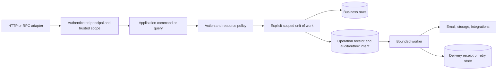

# Production starter re-audit — 15 September 2026

**Verdict: substantially improved, but not ready to be the production foundation for a serious ERP, CRM, or sensitive SaaS application without further fixes.** The modular-monolith direction is sound. The remaining blockers are implementation defects in security, transactions, durable processing, and deployment—not a need for microservices or a different technology stack.

**Production readiness: 4/10. Folder organization: 7/10.** These are engineering judgments, not certifications or percentages of completed work. A passing build and a large test suite do not compensate for a reproducible data-loss path.

**Finding register: 1 critical, 22 high, 9 medium.** This counts the grouped findings below, not separate exploit claims. Several affect optional capabilities and can be excluded from a narrower release, but core transaction, authorization, configuration, and operational defects still require repair.

Start with [verification](#1-scope-evidence-and-limits), [findings](#3-findings), [previous findings](#4-previous-audit-reconciliation), [folder scalability](#5-folder-and-architecture-scalability), [documentation drift](#6-documentation-and-ai-rule-drift), [cloud costs](#7-cloud-efficiency-and-runaway-cost-assessment), and [v1 release gates](#13-before-calling-this-v10).

This evaluates a **general-purpose starter**. Notes is evaluated only where its assumptions, policies, or dependencies affect the reusable foundation. No recommendation here requires turning the starter into a complete ERP or CRM.

## 1. Scope, evidence, and limits

- Audited commit: `93627d0d25c84f1058d9563ecaeef86ef30f1549`.
- Compared with the [11 September audit](PRODUCTION_STARTER_AUDIT_2026-09-11.md) and its baseline commit, `3fb0264a5ad5714ac4f4dccd24571b60eca48d02`.
- The comparison contains 512 changed files, approximately 15,336 added and 6,834 removed lines. File moves and generated/lockfile changes are included; this is not a count of new functionality.
- Inventoried all 1,201 tracked files: API 519, web 148, mobile 113, eight shared packages, 86 files under `docs/`, 12 mandatory AI instruction files, migrations, generators, Docker, and workflows.
- Read the mandatory AI instructions in the prescribed order. Reviewed runtime composition, security boundaries, repositories/transactions, workers/events, client identity handling, configuration, deployment, operational documentation, and changes relevant to the previous findings. Followed important call chains beyond the file containing the apparent fix.
- Checked documentation against implementation; documentation and comments were not accepted as proof of runtime behavior.
- This is a broad source/configuration audit with targeted executable checks. It is **not a claim that every UI story received manual visual review, every path was executed, or every possible vulnerability was found**.
- No deployed AWS account, IAM policies, actual bucket policies/lifecycles, cloud bills, production data, or deployed observability service was available. Cloud findings concern the repository's safeguards and deployment defaults, not an inspected account.
- Docker's Linux daemon was unavailable. Live container startup, PostgreSQL/Redis integration and E2E suites, container vulnerability scans, browser deployment topology, and a real backup recovery were **not verified in this run**. No developer database was reset.
- Application source was not changed. The existing locked dependencies were synchronized, ignored build outputs were generated, and this report was added.

### Verification results

| Check                                                                     | Result                                                | Meaning / limitation                                                                           |
| ------------------------------------------------------------------------- | ----------------------------------------------------- | ---------------------------------------------------------------------------------------------- |
| `pnpm install --frozen-lockfile --ignore-scripts`                         | Passed                                                | Synchronized installed dependencies with the existing lockfile; no manifest/lockfile change    |
| `pnpm rules:check`                                                        | Passed                                                | Dependency and placement rules passed; does not prove transaction or authorization correctness |
| `pnpm exec turbo lint typecheck --force --concurrency=2`                  | 14/14 tasks passed                                    | One unused ESLint-disable warning in the startup banner                                        |
| `pnpm exec turbo build --filter=api --filter=web --force --concurrency=2` | 8/8 tasks passed                                      | API and web compile; Turbo warns that the UI build task declares outputs it does not produce   |
| `pnpm --filter mobile build`                                              | iOS and Android export passed                         | Approximately 3.6/3.7 MB entry bundles; compilation/export, not native-device testing          |
| `pnpm exec turbo build-storybook --filter=@repo/ui --force`               | Passed                                                | Component catalog builds; not manual visual/accessibility verification                         |
| `pnpm exec turbo test:unit --force --concurrency=1 -- --maxWorkers=2`     | **1,059 tests in 217 files passed**                   | API 778; web 151; mobile 96; authorization 20; API client 14                                   |
| `pnpm format:check`                                                       | Passed                                                | Existing matched source/documentation formatted consistently                                   |
| `pnpm audit --json`                                                       | Zero reported advisories; 2,343 dependencies reported | Advisory snapshot only; not a security proof, container scan, or maintenance assessment        |
| Generator smoke in a temporary directory                                  | Official smoke passed, 37 generated TS files          | Additional resolution check found **10 broken generated repository imports**                   |
| Production Compose configuration with CI-equivalent placeholder values    | **Failed**                                            | Requires four PgBouncer variables even without enabling its optional profile                   |
| Source-level failure-path harnesses                                       | Defects reproduced                                    | Actual methods/metadata, mocked external I/O; details below                                    |

The workspace initially had NestJS 11 installed while manifests and the lockfile specified NestJS 12. Initial diagnostics from that stale installation were discarded after synchronization. An initial heavily parallel test run also hit worker-start timeouts; the bounded rerun above passed. Neither is reported as an application defect. Local verification used Node 22.23.2; CI/Docker use 22.12.0, so this is not identical to a container build.

### Controlled reproductions

These ran without real cloud resources or destructive database operations:

```text
String "false" parsed by the environment schema:
  TRUST_PROXY=true, FILE_AV_ENABLED=true, CDN_ENABLED=true,
  S3_FORCE_PATH_STYLE=true
FILE_AV_ENABLED="false" with FILE_AV_URL="": validation fails

Nested transaction side-effect order:
  BEGIN -> COMMIT -> outer-effect -> rolled-back-inner-effect

Privacy purge failure order:
  BEGIN -> DELETE_S3(activeTransaction=true) -> ROLLBACK
  -> later-export-scrub-failure

File scan/promotion with equal-length replacement:
  scanner approved original bytes; copied replacement accepted;
  served="EVIL", status="uploaded", scanOne returned true

Actual Nest testing-module dependency injection for outbox replay:
  workerInjected=false, usedWorker=false, usedSql=true

Expired WebSocket after revalidate + disconnect:
  gateway identity entries=0; registry users=1; retained socket count=1
```

The file test models replacement between scanning and promotion; it does not claim to have executed an attack against a real S3 bucket. The transaction tests exercise the actual scope/callback implementation with a recording database adapter; real PostgreSQL failure injection remains a release gate.

## 2. Improvements verified and worth preserving

1. **The direct ownership-spoofing route has been closed.** The permissions guard no longer treats arbitrary request-body ownership fields as trusted resource state. `UpdateUserCommand` also accepts the authenticated actor and restricts ordinary users to their own name; self-service email changes use a separate flow. See [permissions guard](../apps/api/src/common/guards/permissions.guard.ts) and [user update](../apps/api/src/modules/users/application/commands/update-user.command.ts).
2. **Tenancy provider registration has been repaired in source.** The queries missing in the previous module graph are registered. This closes the identified registration defect, though complete production boot was not executed here. See [tenancy module](../apps/api/src/modules/tenancy/tenancy.module.ts).
3. **Outer after-commit callbacks now run after commit.** Transaction-local PostgreSQL settings are established together, and explicit tenant scope switching updates SQL context. Nested savepoints are now present. Preserve these changes; R01/R06 describe remaining interactions. See [database service](../apps/api/src/infrastructure/database/database.service.ts).
4. **Account/organization erasure now defers Notes/file destruction until the grace-period purge.** This repairs the immediate-request behavior. It does not yet make the eventual purge safe.
5. **Upload quarantine and final-object separation are real.** Reusing an upload URL after promotion no longer directly overwrites the final download key. A scan/promotion race and storage-cost issues remain.
6. **File parent authorization has a registry and fails closed for unknown registered resource types.** This is a useful extension seam; new domain modules must actually register their checker. See [file access registry](../apps/api/src/common/file-access/file-access.registry.ts).
7. **Refresh rotation tracks the session family and consumed token identifiers.** Reuse revokes the session and refresh fails closed when required Redis state is unavailable. Password reset and verification use hashed, atomically consumed tokens.
8. **Local distributed-cache growth is bounded to 10,000 entries with expiry sweeping.** Rate-limit sorted-set growth and metric label cardinality received meaningful bounds. Do not repeat the old claim that this particular cache is unbounded.
9. **Outbox publication is no longer considered complete simply because a job was enqueued.** Consumer completion participates in the state transition. Replay wiring and consumer failure semantics still need correction.
10. **Notifications gained tenant-aware batching and delivered-channel state.** These improve isolation and diagnosis; they are not yet a recovery protocol.
11. **Actual web application type checking is in the quality gate.** Protected web routes explicitly disable SSR, avoiding the previous authenticated SSR misuse for the current application. This is a valid choice, not a missing requirement to re-enable SSR.
12. **The structure is cleaner.** Seven backend domains, capability-specific infrastructure, feature-specific frontend folders, thin web routes, colocated tests, and automated import checks are useful foundations.
13. **Existing operational building blocks are substantial.** Forced RLS on 12 tables, migration locking, database timeouts, non-root container stages, health endpoints, bounded worker batches, circuit breakers, retry limits, metrics, traces, dashboards, runbooks, backup scripts, and secret-scanning CI all exist. The following findings concern their composition and gaps, not their absence.

## 3. Findings

Severity means impact when the affected capability is used: **CRITICAL** risks destructive inconsistency or a fundamental security failure; **HIGH** risks serious production failure; **MEDIUM** affects maintainability, operability, or future correctness; **LOW** is nonurgent cleanup. Optional capabilities are classified separately in section 8. Evidence links point to the audited files; function names identify the relevant implementation.

### R01 — CRITICAL — Privacy purge still deletes object bytes inside a rollback-capable outer transaction

**Evidence:** [`PurgeExpiredErasuresCommand.execute`, `fulfillAccount`, `fulfillOrganization`](../apps/api/src/modules/privacy/application/commands/purge-expired-erasures.command.ts); [`DatabaseService.withSystemScope`](../apps/api/src/infrastructure/database/database.service.ts).

`execute()` says there is no wrapping transaction but calls `withSystemScope(operation)`, which creates one when none exists. The entire batch runs inside it. Tenant scope changes and the apparent per-request transactions reuse that transaction/savepoints. Object deletion is therefore irreversible while subsequent database work remains rollback-capable. A later export-scrub failure reproduced physical deletion followed by rollback. HTTP invocation can additionally enter through the request transaction interceptor.

`readTenantPlan()` also returns an empty array for malformed plans. The caller interprets that as `[undefined]`, continuing under system scope, despite the comment promising failure without deletion. Invalid persisted plans must not silently broaden execution scope.

**Required:** claim a bounded request in a short transaction; commit a validated destruction plan/state; perform idempotent object operations outside _all_ ambient transactions; commit progress/finalization in fresh transactions. Mark malformed plans failed. Inject failure after each phase and after a later request. This is **must-have core lifecycle/transaction correctness**; module-specific destruction policy remains optional/application-owned.

### R02 — HIGH — Quarantine scanning does not bind approval to the bytes promoted

**Evidence:** [`FileScanWorker.scanOne`](../apps/api/src/modules/files/application/workers/file-scan.worker.ts); [`S3Driver.copy`, `getMetadata`](../apps/api/src/infrastructure/storage/drivers/s3.driver.ts).

The worker scans the quarantine key, copies its current contents, and checks the final object's length. A still-valid PUT URL can replace the quarantine object between scan and copy. Equal-length replacement passes. The controlled reproduction returned `uploaded` for the replacement. Separating final and quarantine keys fixes post-promotion overwrite, but not this earlier race.

**Required:** approve an immutable object version or verified digest and promote exactly that version, with a conditional operation where applicable. Record the approved identity. Retry transient scanner failures separately from malicious/invalid content; currently a scanner failure can permanently fail and remove a legitimate upload. **Must-have safety within the optional file module.** Conditional operations are supported by the existing storage technology; no replacement stack is needed. [AWS conditional writes](https://docs.aws.amazon.com/AmazonS3/latest/userguide/conditional-writes.html).

### R03 — HIGH — Upload and download admission limits are not hard storage/egress cost limits

**Evidence:** [`S3Driver.getPresignedUploadUrl`](../apps/api/src/infrastructure/storage/drivers/s3.driver.ts); [upload reservation/quota](../apps/api/src/modules/files/application/commands/request-upload.command.ts); [file repository](../apps/api/src/modules/files/infrastructure/repositories/files.repository.ts); [cleanup](../apps/api/src/modules/files/application/workers/file-cleanup.worker.ts).

The signed PUT contains bucket, key, and content type; it does not bind the declared file size or an approved checksum. The 10 MiB request validation and 100 MiB accounting quota apply to declared metadata. Oversized bytes can reach storage before a later check rejects them. Upload URLs last 900 seconds and are reusable. Recreating quarantine bytes after successful promotion/cleanup leaves an object that row-driven cleanup does not necessarily revisit. No bucket inventory/lifecycle provisioning closes this gap.

The quota query is filtered by uploader but still executes under active-tenant RLS, so it does **not** implement the documentation's global per-user quota across organizations. A signed download can be requested once and used repeatedly during its validity, without consuming additional API rate-limit requests. S3 presigned URLs are reusable until expiry and can replace objects at the signed key. [AWS presigned URL behavior](https://docs.aws.amazon.com/AmazonS3/latest/userguide/using-presigned-url.html).

**Required:** storage-enforced upload conditions, truthful reservation/accounting scope, quarantine-specific lifecycle cleanup, reconciliation of actual objects and rows, account/tenant admission budgets, and deliberate private-download/egress policy. CDN delivery alone is not an egress budget. **Must-have cost/safety controls when files are enabled.**

### R04 — HIGH — Environment boolean coercion breaks disabled settings and deployment defaults

**Evidence:** [`envSchema`](../packages/contracts/src/schemas/env.schema.ts), [loader](../apps/api/src/config/env.ts), [production Compose](../docker/docker-compose.prod.yml).

`z.coerce.boolean()` interprets the nonempty string `"false"` as true. This affects `TRUST_PROXY`, `FILE_AV_ENABLED`, `CDN_ENABLED`, and `S3_FORCE_PATH_STYLE`. The actual schema reproduced all four. Compose supplies `FILE_AV_ENABLED=false` and an empty scanner URL by default; validation then requires a scanner URL. A configuration intended to disable proxy trust enables it instead.

**Required:** explicit accepted boolean-string parsing; reject unknown values. Execute configuration tests with the exact string-valued environment emitted by each deployment profile. **Must-have core.** Do not repair this by only changing README examples.

### R05 — HIGH — Generic authorization defaults overgrant future business actions

**Evidence:** [authorization evaluator](../packages/authorization/src/evaluator.ts), [permissions](../packages/authorization/src/permissions.ts), [ownership policy](../apps/api/src/infrastructure/authorization/policies/ownership.policy.ts), [tenant-admin policy](../apps/api/src/infrastructure/authorization/policies/tenant-admin.policy.ts).

Resource ownership automatically grants any requested action. A creator could therefore acquire a future `invoice:approve`, `payment:release`, or `record:destroy` permission unless every module remembers an explicit denial. Global admin bypass precedes explicit DENY. Tenant mismatch is checked only when both sides supply tenant IDs. Global user permissions are unioned with tenant permissions, and `files:write` matches every `files:*` action, including delete. Tenant owner permissions use `Object.values(Permissions)`, automatically inheriting future global capabilities.

These are verified engine semantics, **not a claim that an invoice API already exists**. They are unsafe defaults for a reusable ERP/CRM foundation. Frontend checks remain UX only; trusted backend resource loading and application-level action policies must be the security boundary.

**Required:** action-specific ownership; explicit global versus tenant capabilities; default denial for missing required resource scope; deliberate, audited super-admin bypass; prevent tenant roles inheriting platform permissions by enumeration. Test denied actions through both transports and direct application commands. **Must-have core.** Dynamic role editors, branch hierarchies, permission groups, and approval matrices remain optional/domain features.

### R06 — HIGH — Savepoint rollback does not roll back registered after-commit callbacks

**Evidence:** [`TransactionScopes.withSavepointResult`, `withSavepoint`](../apps/api/src/infrastructure/database/transaction-scopes.ts); [callback storage/drain](../apps/api/src/infrastructure/database/database.service.ts).

Nested database state is now rolled back to a savepoint on failure, but the shared after-commit callback array is not restored. If the outer operation handles an inner `Err` and commits, effects registered by the rolled-back inner operation still run. This was reproduced. It can create audit/realtime/revocation effects for changes that never committed.

Scope restoration failures are also logged without necessarily aborting the enclosing unit. `withAdvisoryLock()` silently runs unlocked without an ambient transaction. Those convenience fallbacks make missing transaction setup appear successful.

**Required:** callback frames aligned to transaction/savepoint nesting; discard failed frames; fail closed on failed scope restoration or missing required transactional capabilities. Test composition, not only individual helper return values. **Must-have core.**

### R07 — HIGH — Notification digest reads leave SQL scope after the initial claim

**Evidence:** [`DigestWorker.closeDueWindows`, `deliverWindow`](../apps/api/src/modules/notifications/application/workers/digest.worker.ts); [base read repository](../apps/api/src/infrastructure/database/repositories/base-read.repository.ts).

The initial due-window query correctly opens a system-scoped transaction. It finishes before `deliverWindow()` calls `batches.findById()` and subsequent repositories. JavaScript system context remains, but the pool query has no transaction-local SQL settings. Under the intended non-bypass RLS runtime role, these reads can return no rows and delivery stalls silently. A superuser test database can mask this.

**Required:** short explicit SQL units for claim, reads, and state transitions, with external delivery outside transactions. Exercise the complete worker using the actual restricted runtime role and a separate migration role. PostgreSQL superusers/BYPASSRLS roles bypass policies even where ordinary callers are constrained. [PostgreSQL RLS documentation](https://www.postgresql.org/docs/current/ddl-rowsecurity.html). **Must-have correctness when notifications are enabled.**

### R08 — HIGH — Realtime revocation is incomplete, and expired sockets leak registry entries

**Evidence:** [gateway](../apps/api/src/infrastructure/realtime/transports/realtime-websocket.gateway.ts), [registry](../apps/api/src/infrastructure/realtime/connections/realtime-connection.registry.ts), [SSE controller](../apps/api/src/infrastructure/realtime/transports/realtime-sse.controller.ts), [revocation listener](../apps/api/src/infrastructure/realtime/listeners/realtime-auth.listener.ts), [member removal](../apps/api/src/modules/tenancy/application/commands/remove-member.command.ts).

`revalidateConnections()` closes a socket and deletes its identity before `handleDisconnect()` uses that identity to remove it from the shared registry. The reproduced result retained the closed socket and user entry. Over time this retains memory and consumes the per-user/tenant connection allowance.

Membership-removal listeners exist, but `RemoveMemberCommand` emits none of their events. Organization purge emits `privacy.organization.purged`, while the realtime listener watches `organization.purged`. SSE has no equivalent periodic expiration/membership revalidation. Existing streams can therefore retain access after membership changes. WebSocket polling only partially compensates and performs sequential per-socket membership reads without an overlap guard.

The gateway also has no explicit `/ws` path while the proxy and comments assume one; confirm an actual browser handshake against the release image. Query-string bearer fallback exposes credentials to ordinary proxy URL logs. Buffered-send protection is not applied uniformly to broadcast paths.

**Required:** one idempotent disconnect path; emit/consume versioned revocation events consistently; bounded expiry/revalidation for both transports; bounded broadcast buffers; an explicit tested transport path; short-lived handshake tickets or a log-safe authentication mechanism. **Must-have safety inside an optional realtime module.**

### R09 — HIGH — Redis recovery stops instead of restoring dependent services

**Evidence:** [`RedisService.connect`](../apps/api/src/infrastructure/redis/redis.service.ts), [cache subscriber](../apps/api/src/infrastructure/cache/distributed-cache.service.ts), [feature-flag subscriber](../apps/api/src/infrastructure/feature-flags/feature-flags.service.ts).

The first startup connection error disconnects and sets the client to null. The retry strategy stops after three attempts, including subsequent disconnects. Dependents that skip initialization do not automatically initialize again. A recovered Redis server can leave authentication rotation, invalidation, revocation subscriptions, and flags broken until process restart. A non-null but ended client is also not a reliable availability signal.

**Required:** bounded per-request waits plus ongoing reconnect with backoff/jitter; lifecycle notifications that restore subscriptions; readiness based on usable state. Explicitly classify security/session and queue state as required, while optional cache misses may degrade. Configure durable Redis persistence/no-eviction where BullMQ and sessions require it. Separate disposable cache capacity later if contention justifies it. **Must-have core reliability.**

### R10 — HIGH — HTTP idempotency still cannot guarantee durable mutation deduplication

**Evidence:** [interceptor](../apps/api/src/common/interceptors/idempotency.interceptor.ts), [store](../apps/api/src/common/utils/idempotency.store.ts), [Lua/fingerprint helpers](../apps/api/src/common/utils/idempotency.utils.ts).

Concrete resource path and query now participate in the fingerprint, closing the earlier cross-resource response confusion. However, business SQL commits separately from the Redis response receipt. A crash/cache failure after commit allows a repeated mutation. Oversized/unserializable responses release the key after successful work. Lease recovery/finalization uses the same request fingerprint rather than a unique claim generation, so an old owner can act on a later identical request's claim.

**Required:** label this interceptor as best-effort transport deduplication. For durable business operations, persist a unique operation identifier and result/state with the business transaction; propagate it into jobs and provider calls. Add lease owner tokens where leases are used. **Must-have core primitive; each financial/business invariant remains application-owned.**

### R11 — HIGH — Outbox replay's repaired worker path is not injected

**Evidence:** [`OutboxService`](../apps/api/src/infrastructure/outbox/outbox.service.ts), [event worker](../apps/api/src/infrastructure/outbox/outbox-event.worker.ts).

The new replay dependency is imported with `import type` and has `@Optional()` without an explicit injection token. Runtime constructor metadata is `Object`, not `OutboxEventWorker`. A real Nest testing module with the worker registered reproduced `workerInjected=false`: replay used only the SQL fallback. That omits the worker's Redis marker/BullMQ retained-job cleanup, so a requeued row can still fail to execute as intended.

Consumer delivery also passes only payload to listeners. An event-level Redis marker is not a durable per-consumer inbox. Several listeners catch/log errors; the installed Nest event-emitter loader defaults `suppressErrors` to true. Thus `emitAsync()` completion need not mean every required side effect succeeded.

**Required:** explicit runtime port/token and no success fallback that omits necessary replay work; stable event ID/version/tenant/actor/correlation envelope; durable per-consumer deduplication for required effects; visible retryable failures. Keep EventEmitter for best-effort local reactions, or use a small explicit durable handler registry. **Must-have core if durable events are part of the promise.**

### R12 — HIGH — Delivery-channel bookkeeping is not delivery recovery

**Evidence:** [send notification](../apps/api/src/modules/notifications/application/commands/send-notification.command.ts), [digest worker](../apps/api/src/modules/notifications/application/workers/digest.worker.ts), [fan-out listener](../apps/api/src/modules/notifications/application/listeners/domain-event-fanout.listener.ts), [email worker](../apps/api/src/infrastructure/email/email-queue.worker.ts).

`deliveredChannels` records successful effects, but failed/missing channels do not have a durable independent retry state. Digests are marked delivered before email/push completes; an existing center row can make a retry consider the batch complete. A crash leaves undelivered channels with no reliable continuation. Notification fan-out failures are logged and swallowed. Account email queue IDs were fixed, but fallback sends and swallowed errors can still let an originating event complete without delivery.

**Required:** commit an intent per required channel; process with bounded retries/backoff, provider idempotency where supported, and permanent-failure status. Define in-app visibility separately from external delivery. Do not claim exactly-once email. **Should-have core delivery plumbing; inbox, push, and digest features optional.**

### R13 — HIGH — Authentication lifecycle has gaps beyond token rotation

**Evidence:** [session service](../apps/api/src/infrastructure/session/session.service.ts), [refresh command](../apps/api/src/modules/auth/application/commands/refresh-tokens.command.ts), [auth guard](../apps/api/src/common/guards/auth.guard.ts), [JWT utilities](../apps/api/src/modules/auth/application/utils/jwt.utils.ts), [email change](../apps/api/src/modules/users/application/commands/verify-email-change.command.ts), [admin user update](../apps/api/src/modules/users/application/commands/update-user.command.ts).

Per-user Redis session sets have no expiry/pruning of naturally expired session IDs. `getActiveSessions()` reads the entire set and MGETs every key; repeated sessions create persistent index growth. Refresh rotation extends family-marker lifetime and issues a fresh refresh token without renewing the underlying session record. This creates a mismatch unless absolute session expiry is explicitly intended and exposed.

Access tokens are validated by user `authVersion`, not a session ID. Revoking one refresh session does not by itself invalidate already-issued HTTP access tokens. That can be an intentional bounded 15-minute window, but must be described accurately and supported by security-sensitive reauthentication/revocation requirements. Session creation also returns credentials when Redis is absent even though the session was not persisted.

The dedicated verified-email-change command bumps `authVersion`, but does not emit the revocation event/cache invalidation used by other identity changes; long-lived realtime connections do not automatically gain the HTTP guard's protection. Administrative email updates do not apply the same verification/version invariants. Do not treat the new self-service flow as proof that every identity-change path is consistent.

**Required:** choose absolute/sliding session semantics, bound active sessions and prune indexes, unify identity-change side effects, define immediate versus bounded revocation, and make unavailable session persistence explicit. **Must-have core.** MFA/step-up support should be available for privileged serious applications; complete OIDC enterprise federation remains an optional integration.

### R14 — HIGH — Bounded caches still expose mutable state and pre-commit invalidation races

**Evidence:** [`DistributedCacheService.getOrSet`](../apps/api/src/infrastructure/cache/distributed-cache.service.ts), [`UpdateUserCommand.persist/execute`](../apps/api/src/modules/users/application/commands/update-user.command.ts).

The local cache retains and returns the same `Result` and mutable entity. `UpdateUserCommand` mutates `existing.value` before persistence. A later failure/rollback can leave other readers observing a changed in-memory entity. The 10,000-entry bound fixes capacity, not this correctness problem.

Invalidation after a nested `withResultTransaction()` can also occur before the enclosing request transaction commits. Another instance may refill old data between invalidation and commit. Pub/sub loss leaves stale local caches until TTL. Cache keys and consistency guarantees must be defined per use case; authorization already uses fresh reads in important paths and should keep doing so.

**Required:** cache immutable snapshots, reconstruct domain objects, invalidate only after the outer commit, and use versioned/durable invalidation only where correctness requires it. Prefer removing an unnecessary cache over building a complex coherence system. **Must-have core cache contract.**

### R15 — HIGH — Mobile automatic authentication failure does not isolate the next identity's cache

**Evidence:** [mobile API callbacks](../apps/mobile/src/lib/api.ts), [mobile query client](../apps/mobile/src/lib/query-client.tsx), [query keys](../apps/mobile/src/lib/query-keys.ts), [auth store](../apps/mobile/src/stores/auth.store.ts).

`onAuthFailure` clears authentication only. It does not clear the query client or active tenant. Query keys do not consistently include user identity. After token failure and another user's login, previously cached private data can survive. Explicit logout cleanup does not cover this automatic path.

**Required:** one identity-boundary function for logout, refresh failure, account change, erasure, and revoked session: cancel requests, clear private cache, reset tenant, then change credentials. Test user A → expired refresh → user B, including shared-tenant and single-tenant cases. **Must-have within the optional mobile app.** Web's protected SSR is currently disabled; do not introduce authenticated SSR without request-local clients and hydration isolation.

### R16 — HIGH — Rate limiting is bounded but not uniform or cost-aware

**Evidence:** [guard order](../apps/api/src/app.module.ts), [rate guard](../apps/api/src/common/guards/rate-limit.guard.ts), [rate service](../apps/api/src/infrastructure/rate-limit/rate-limit.service.ts), [REST privacy](../apps/api/src/modules/privacy/presentation/controllers/privacy.controller.ts), [RPC privacy](../apps/api/src/modules/privacy/presentation/orpc/privacy.orpc.controller.ts).

Rate limiting now precedes tenant/permission checks, a real improvement, but authentication still runs first and can perform a fresh database lookup. Requests rejected there do not reach the normal limiter. Limits are primarily IP/route oriented; tenant-budget infrastructure is not consistently used. Validated `RATE_LIMIT_MAX`/`RATE_LIMIT_TTL` values do not drive the guard's fixed fallback limits.

REST privacy export has `@Idempotent()` and `@RateLimit(10, 60)`; RPC `requestExport` has neither. Erasure and purge RPC handlers omit the REST-specific tighter rate limits. Calling the REST controller method from RPC does not re-run its Nest decorators. The preferred application transport consequently has weaker admission controls for expensive work.

**Required:** cheap ingress limits before expensive authentication; consistent endpoint metadata across transports; aggregate actor/tenant budgets and concurrency admission for exports, email, uploads, and organization creation. Include security metadata in parity tests. **Must-have core; product tiers and pricing are application-level.**

### R17 — HIGH — The production logger defaults to an unreachable sink without stdout fallback

**Evidence:** [`buildLoggerTransport`](../apps/api/src/infrastructure/logger/logger.service.ts), [`LOKI_HOST` default](../packages/contracts/src/schemas/env.schema.ts), [production Compose](../docker/docker-compose.prod.yml).

Production selects a single `pino-loki` transport when `LOKI_HOST` is set. The schema defaults it to `http://localhost:3100`; production Compose does not inject a reachable Loki endpoint. Inside the API/worker container this points back to itself. `silenceErrors: true` suppresses sink errors, and this transport configuration has no stdout destination. Structured application logs can therefore disappear precisely when they are needed. Setting an empty string is not a clean disable path because the schema requires a URL.

**Required:** structured stdout as the production default, with an external collector; or an explicit optional remote transport with visible failures and bounded buffering. Wire endpoint/credentials intentionally. Test a log emitted by the actual release container appearing in the operational destination while the remote sink is down/up. **Must-have core.**

### R18 — HIGH — Worker metrics and health alerts are not wired to the deployed process topology

**Evidence:** [worker bootstrap](../apps/api/src/main.ts), [Prometheus targets](../docker/observability/prometheus/prometheus.yml), [worker health metric](../apps/api/src/infrastructure/health/worker-health.indicator.ts), [HTTP metrics](../apps/api/src/infrastructure/metrics/metrics.interceptor.ts), [trace/log datasource mapping](../docker/observability/grafana/provisioning/datasources/datasources.yml).

Dedicated workers use `createApplicationContext`, exposing no HTTP metrics endpoint. Worker-local queue/outbox/file metrics do not appear in the API process's registry. Prometheus scrapes only the development host API, using a fixed development token. Thus existing queue alerts are not evidence that the production worker is monitored.

`worker_heartbeats_active` is updated when the health indicator is invoked. Compose uses liveness and process existence, so an absent/frozen series need not trigger `== 0`. `MetricsInterceptor` records on each Observable emission, decrementing the active gauge repeatedly for SSE, and lacks cancellation finalization. Guard rejection paths precede the interceptor. Logs use `service=api`, traces use `service.name=api-service`, and the trace-to-log mapping assumes they match.

**Required:** a reachable per-process metrics exporter, production service discovery/auth, independent heartbeat observation with missing-series alerts, correct stream lifecycle metrics, and consistent service/role names. Trace required asynchronous work through an event envelope. Prove an induced worker failure reaches a real alert destination. **Must-have core observability.**

### R19 — HIGH — Deployment and CI do not establish a tested immutable release

**Evidence:** [CI](../.github/workflows/ci.yml), [CD](../.github/workflows/cd.yml), [production Compose](../docker/docker-compose.prod.yml), [operations guide](PRODUCTION_OPS.md).

CI's production Compose validation omits four required `PGBOUNCER_DB_*` values. Compose interpolates them even with the pooling profile disabled; this failure was reproduced without a Docker daemon. CD has those placeholders, but CI does not.

Application services use `build:` without selecting the published image through `TAG`. Consequently, the documented `TAG=... docker compose ... up` command does not deploy or roll back to that registry tag. CD publishes independently of CI completion and pushes `latest` before image scanning; the final deployment step prints instructions instead of performing a verified deployment.

**Required:** validate every supported profile; build/scan/test once; promote immutable image digests only after required checks; deploy that artifact; apply migrations with a distinct role/direct connection; verify readiness and smoke tests; rehearse rollback compatible with schema changes. A manual deployment is acceptable if these guarantees are real. **Must-have core release recipe.**

### R20 — HIGH — Proxy trust, TLS, and readiness are not a coherent production boundary

**Evidence:** [NGINX configuration](../docker/nginx.conf), [production Compose](../docker/docker-compose.prod.yml), [bootstrap](../apps/api/src/main.ts), [database operations documentation](DATABASE.md).

The API can trust all proxy hops, while NGINX appends the incoming `X-Forwarded-For` chain. Without a constrained trusted-ingress design, forged forwarded values can undermine IP-based controls. R04 further makes `TRUST_PROXY=false` unsafe. The HTTP listener serves application traffic; secure deployment depends on an external TLS boundary or an explicitly enforced HTTPS profile.

Healthchecks use API liveness and worker process existence. These do not prove dependency readiness or job progress. The documentation's claim that NGINX stops routing because an API readiness probe becomes unhealthy is not implemented by the static upstream configuration alone. New shutdown hooks and the NGINX template-generation fix are useful, but do not provide the missing routing/readiness contract.

**Required:** one documented ingress model with network restrictions, sanitized/validated forwarding, TLS enforcement, readiness-aware routing, and graceful drain during replacement. **Must-have production infrastructure.** Same-origin browser deployment is already the stated supported cookie topology; separate-host cookie support need not be added unless a project requires it.

### R21 — HIGH — Privacy exports/plans can still be incomplete, and generation multiplies stored data

**Evidence:** [`RequestExportCommand`](../apps/api/src/modules/privacy/application/commands/request-export.command.ts), [account erasure planning](../apps/api/src/modules/privacy/application/commands/request-account-erasure.command.ts), [organization erasure planning](../apps/api/src/modules/privacy/application/commands/request-organization-erasure.command.ts), [privacy repository](../apps/api/src/modules/privacy/infrastructure/repositories/privacy.repository.ts).

The export now labels many dependency failures and caps Notes/files collections—real improvements. But `collectAccesses()` silently breaks on a failed organization page without propagating incomplete state. File listing fetches a capped first page and cannot reliably distinguish exactly-at-limit from additional omitted records. A `READY` payload with `incomplete`/`truncated` flags is not a mechanism to complete the missing data. Erasure-plan collection must similarly propagate failures instead of accepting an incomplete plan.

Exports synchronously assemble multiple datasets inside a transaction and store another JSON snapshot per accepted request. There is no one-pending-export/cooldown budget. Only 25 expired export snapshots are scrubbed per nightly purge. Intake can therefore exceed disposal by orders of magnitude, particularly through R16's RPC path.

**Required:** durable, resumable paginated export jobs with explicit complete/partial/failed state, bounded total work/bytes, admission quotas, and disposal capacity that exceeds admitted throughput. Sensitive snapshot links and artifacts need TTL and access checks. **Should-have reusable privacy orchestration; data inventory and legally required contents are project-specific.**

### R22 — HIGH — Maintenance bounds protect one tick but do not ensure eventual progress or bounded cost

**Evidence:** [file reconciliation](../apps/api/src/modules/files/application/workers/file-reconciliation.worker.ts), [file repository](../apps/api/src/modules/files/infrastructure/repositories/files.repository.ts), [cleanup](../apps/api/src/modules/files/application/workers/file-cleanup.worker.ts), [outbox relay](../apps/api/src/infrastructure/outbox/outbox-relay.worker.ts), [Loki config](../docker/observability/loki/loki-config.yml).

File reconciliation selects up to 100 uploaded rows without a traversal cursor/checked timestamp. Healthy rows remain eligible, so repeated runs can inspect the same subset and never reach later rows. It repairs row status, not arbitrary orphan objects despite broader runbook claims. Cleanup examines 100 rows per category per night. These limits bound a tick but not backlog growth or oldest-item age.

Outbox admission is ten rows per five-second relay cycle per worker, at most approximately two events/second before processing overhead. The relay runs stale-lock recovery, pending polling/counting, and published retention every tick, including idle periods. This creates avoidable background database work and motivates measured batching rather than scaling replicas blindly.

Loki has no enabled retention configuration; Docker log rotation/resource budgets are not provided in the production profile. Loki's documented default retains logs indefinitely. [Grafana retention documentation](https://grafana.com/docs/loki/latest/operations/storage/retention/).

**Required:** fair cursor/lease traversal, bounded loops with rescheduling, per-task backlog/oldest-age SLOs, separate maintenance cadence, measured drain capacity, explicit log/object/data retention and storage caps. **Must-have operational foundation.** Do not remove bounds; make bounded work progress.

### R23 — MEDIUM — Migration lineage is still a pre-production baseline, not a fork upgrade strategy

**Evidence:** [single initial migration](../migrations/pg/0000_initial.sql), [migration policy](../migrations/pg/README.md), [migration check](../apps/api/src/infrastructure/database/migration-check.ts).

The repository explicitly squashed migrations because no production database existed. That is reasonable before first release. Current schema additions are in `0000_initial`; an already-applied earlier version will not receive those changes by replaying the same baseline. With one migration, the check only exercises a fresh baseline, not an upgrade from the previous deployed starter.

**Required before v1:** freeze the released baseline, append subsequent migrations, keep a released-version upgrade fixture, and define how downstream forks consume security fixes without overwriting their domain migrations. Test expand/contract compatibility during rolling releases. **Must-have core release policy**, not a reason to undo the justified pre-production squash.

### R24 — MEDIUM — Repositories are reusable, but the abstraction leaves important database invariants implicit

**Evidence:** [base repository](../apps/api/src/infrastructure/database/repositories/base.repository.ts), [base read repository](../apps/api/src/infrastructure/database/repositories/base-read.repository.ts), [SQL baseline](../migrations/pg/0000_initial.sql), [owner removal](../apps/api/src/modules/tenancy/application/commands/remove-member.command.ts).

Pools, parameterized queries, timeouts, RLS, indexes, and bounded reads exist. However, generic string-keyed filters can silently ignore unknown keys; pagination lacks a universal stable ordering contract; generic updates do not uniformly express soft-deleted/version constraints. No SQL foreign keys are declared in the baseline. Module boundaries do not require abandoning database integrity: relationships inside an aggregate should have database-enforced invariants where appropriate.

Owner/quota locks fix common check-then-write races. Owner mutation chooses whether to lock based on a pre-lock role read; concurrent promotion/removal/demotion combinations still need transaction-level tests and a consistent lock protocol, not just the two-owner example. This interleaving risk was source-reviewed, not reproduced against PostgreSQL here.

**Required:** typed filters, explicit ordering/cursor options, invariant-specific atomic statements/constraints and optimistic version checks, restricted runtime credentials, and a fail-closed scoped repository interface. Budget connections across all instances: `(API replicas + worker replicas) × per-process pool`, plus tools/exporters/migrations. **Must-have core conventions; domain constraints belong to each module.**

### R25 — MEDIUM — Folder boundaries are good, but shared ownership can still become a bottleneck

**Evidence:** [module rules](../ai_instructions/MODULE_RULES.md), [placement rules](../ai_instructions/FILE_PLACEMENT_RULES.md), [dependency rules](../.dependency-cruiser.cjs), [contracts](../packages/contracts/src), [authorization](../packages/authorization/src), [API composition](../apps/api/src/app.module.ts).

The backend is not a single-folder dump. Its largest command directory contains 26 TS files including tests; `common/utils` contains 22. No inspected backend application TS file exceeds 400 lines in the tracked-file census. The UI primitive catalog has 121 TS/TSX files including stories, which is a different concern from mixing business features into a shared folder. The 693-line sidebar is a library primitive and should be assessed under its documented exception, not called an application-rule violation.

The future risks are centralized permission/contract/notification registries, deep cross-module command/query imports, many global providers, and an overly broad interpretation of “every type belongs in contracts.” These can turn shared packages into organizational dumping grounds even while every individual file is short. Present application commands depend on concrete module repositories; this is a pragmatic layered monolith, not completely persistence-independent clean architecture.

**Required:** explicit feature ownership and public exports; keep private implementation types local; add resource/subdomain grouping only when a capability grows; restrict shared packages to stable cross-boundary contracts. Maintain import rules for direction and cycles. **Should-have core conventions.** Do not add directories just to make the tree look enterprise-sized.

### R26 — HIGH — The generator propagates broken imports and unsafe reference patterns

**Evidence:** [application generator](../scripts/generators/application.generator.js), [repository generator](../scripts/generators/infrastructure.generator.js), [smoke test](../scripts/generators/generator-smoke.js).

Repositories are generated under `infrastructure/repositories/`, but generated commands, queries, and tests import `../../infrastructure/<name>.repository`. The official smoke test transpiles syntax only, so it passed despite ten missing imports in the generated slice. It does not resolve modules or typecheck the generated application.

Generated commands also directly emit mutation events inside the database transaction. Generated resource queries accept `_actor` but do not use it for resource authorization. That may be valid for an explicitly tenant-shared domain, but it is an unsafe unqualified reference for private resources or ERP approvals.

**Required:** generate a real module into a disposable checkout/fixture, wire it, typecheck/build it, and test transaction rollback and ownership policy. Update generated examples to the same safe patterns as hand-written code. **Must-have starter developer tooling.** A generator amplifies defects across every future project.

### R27 — MEDIUM — Documentation and AI instructions still contradict both code and each other

**Evidence:** detailed drift table in section 6.

Some docs describe completed delivery, automatic routing/readiness, globally enforced quotas, or external I/O outside transactions where the implementation does not support those guarantees. Other docs describe old behavior that has already been fixed. AI rules still say there is no language-switcher UI despite the new settings component; AGENTS and code-quality rules disagree on function size. These conflicts steer future contributors into inconsistent implementations.

**Required:** one authoritative rule per topic, runnable examples, generated environment/route references where practical, and explicit “implemented / configured / verified” status. Make guarantees testable rather than aspirational. **Must-have core documentation discipline.**

### R28 — MEDIUM — Audit trails and recovery tooling are incomplete for business-record governance

**Evidence:** [audit listener](../apps/api/src/infrastructure/audit/audit.listener.ts), [audit retention](../apps/api/src/infrastructure/audit/audit-retention.worker.ts), [immutability SQL](../migrations/pg/0000_initial.sql), [restore verification](../scripts/db-restore-verify.sh), [privacy policy](PRIVACY.md).

An immutability trigger and controlled retention function exist; they should be preserved. Audit creation after commit is nevertheless best-effort: a crash or listener failure can lose the audit record while business data remains committed. It is not sufficient for transactions that require an atomic business audit trail. General logs include raw URL/message data and lack a central Pino redaction policy, so telemetry needs a defined sensitive-data policy too.

The restore script verifies gzip integrity, successful SQL restore, and at least one table. It does not verify domain invariants, restored object bytes, runtime grants/RLS behavior, queue/outbox reconciliation, or startup of the matching application release. This is useful backup tooling, not a proven RTO/RPO.

**Required:** durable audit intent with critical mutations; restricted audit/retention privileges; tested retention/anonymization policies; recovery drills spanning SQL, objects, and asynchronous work. Keep historical business references to a tombstoned/anonymized subject where records must remain. Consent, legal holds, financial retention periods, and immutable ledgers are **application policy**, not blanket GDPR assertions embedded in a generic purge service. **Core hooks and recovery contract required; specialized compliance modules optional.**

### R29 — MEDIUM — Cloud identity and dependency upgrades need an operational policy

**Evidence:** [S3 driver](../apps/api/src/infrastructure/storage/drivers/s3.driver.ts), [environment schema](../packages/contracts/src/schemas/env.schema.ts), [Dockerfile](../Dockerfile), [CI/CD](../.github/workflows), [Nest adoption ADR](adr/0067-nestjs-12-feature-adoption.md), [workspace policy](../pnpm-workspace.yaml).

The S3 client always supplies access-key/secret credentials, preventing normal use of the SDK's workload-identity credential chain in that configuration. File-mounted secret loading exists, but is not the same as a complete runtime-identity/IAM deployment. No cloud role/bucket policy in the repository proves least-privilege access or prevents public object exposure.

Dependency advisories reported zero at audit time. That does not establish a safe operating-system image or supported patch policy. CI/Docker pin Node 22.12.0, local checks ran 22.23.2, and the Nest ADR describes Node 24. Some workflows pin actions to tags while the security workflow uses SHAs. `pnpm prune --prod` in the Docker build still needs actual workspace image verification; source compilation does not establish runtime packaging correctness.

NestJS 12's ESM and runtime requirements are real, so the earlier stale-install diagnostics must not be mistaken for unsupported framework APIs. [Official Nest migration guide](https://docs.nestjs.com/migration-guide). Keep the locked stack; test upgrades as a coordinated Node/Nest/Fastify/oRPC/TypeScript compatibility change. TanStack web and Expo mobile similarly require coordinated React upgrades.

**Required:** current supported runtime patch policy, immutable scanned images, dependency/lockfile update cadence, workload identity support using the existing SDK, and documented least-privilege permissions. **Must-have operating policy; provider-specific deployment adapters optional.** No dependency replacement is justified merely by popularity.

### R30 — MEDIUM — API and request filtering need a smaller, explicit contract

**Evidence:** [WAF patterns](../apps/api/src/infrastructure/waf/waf.patterns.ts), [middleware](../apps/api/src/infrastructure/waf/waf.middleware.ts), [REST/RPC adapters](../apps/api/src/modules/privacy/presentation), [bootstrap load shedding](../apps/api/src/main.ts), [API docs](../apps/api/src/infrastructure/api-docs).

Versioned APIs, Zod validation, response schemas, a common error envelope, and generated documentation are implemented. But duplicated transport metadata drifts (R16). The load-shedding response uses a separately constructed error shape. Blanket SQL/XSS regex screening rejects legitimate general-purpose business content such as documentation containing `UNION SELECT` or comment syntax. It cannot replace parameterized SQL, safe rendering, schema validation, or provider-grade ingress protection. Previous broad pattern issues were reduced, but content false positives remain inherent to this approach.

**Required:** one canonical endpoint policy description, runtime parity tests for status/errors/security, predictable pagination/filter/sort contracts, explicit request/response size limits, and narrowly justified edge filters. Maintain parameterized SQL and contextual output escaping. **Must-have core API contract; advanced search/reporting APIs are optional/application-owned.**

### R31 — MEDIUM — Frontend foundations are usable, but enterprise UX capabilities are uneven

**Evidence:** [web features](../apps/web/src/features), [web route boundary](../apps/web/src/routes/_app.tsx), [composed UI](../packages/ui/src/components/composed), [web i18n](../apps/web/src/lib/i18n.tsx), [mobile i18n](../apps/mobile/src/lib/i18n.ts), [client beacon](../apps/web/src/lib/client-beacon.ts).

Routing, query/state separation, form validation, loading/empty/error states, dialogs, tables, theming, translations, error boundaries, and feature extraction are present. Builds produce separate route chunks. These are assets to reuse.

Current locale support is English/Spanish/French; setting HTML `lang` is not RTL readiness, and the mobile locale adapter does not implement an RTL lifecycle. Shared formatting and translation conventions need extension for project requirements. Tables demonstrate common CRUD rather than guaranteed performance with thousands of rendered rows. No full accessibility, native-device, bundle-budget, or browser performance certification was performed. Large administrative screens will need measured server-side filtering, pagination, selective virtualization, and permission-aware navigation.

**Required:** automated accessibility and bundle budgets for the shared shell, a tested identity boundary (R15), feature-owned screen logic, and one notification/form-error convention. Keep private screen authorization on the backend. **Should-have core UX standards; RTL, advanced grids, workflow designers, and specialized reporting optional.**

### R32 — MEDIUM — Notes remains coupled to reusable composition and lifecycle code

**Evidence:** [API composition](../apps/api/src/app.module.ts), [privacy module](../apps/api/src/modules/privacy/privacy.module.ts), [privacy export](../apps/api/src/modules/privacy/application/commands/request-export.command.ts), [permissions](../packages/authorization/src/permissions.ts), [sidebar](../apps/web/src/components/app-sidebar.tsx), [header](../apps/web/src/components/app-header.tsx), [new-project guide](STARTING_A_NEW_PROJECT.md).

Removing Notes requires edits to privacy imports/providers, permissions/ownership vocabularies, contracts/client routes, migrations/check fixtures, navigation, and dashboard/reference tests. Documentation honestly lists some of that work, but the sample is still not an independently removable vertical slice. `@Optional()` injection does not make a static module import optional.

**Required:** explicit example composition; feature-owned permission/navigation contributions; small lifecycle contributor ports for export/erasure instead of privacy importing every future business module. Test generating a new project with Notes disabled/removed, while retaining auth, tenancy, health, tests, and builds. **Must-have starter reusability.** Do not build a dynamic plugin marketplace or reflection-heavy module loader.

## 4. Previous audit reconciliation

“Fixed” closes the specific old defect based on current source/checks, not an entire subsystem certification. “Partial” means useful work landed but the original guarantee is still incomplete. Current severity is in R01–R32; old IDs retain their original meaning.

| Previous finding                     | Re-audit status                              | Evidence / remaining work                                                                                                          |
| ------------------------------------ | -------------------------------------------- | ---------------------------------------------------------------------------------------------------------------------------------- |
| C01 ownership spoofing               | Fixed specific bypass                        | Trusted guard resource handling and actor-scoped user update; generic overgrant remains R05                                        |
| C02 missing tenancy providers        | Fixed in module source                       | Providers registered; full infrastructure-backed boot still unverified                                                             |
| C03 irreversible erasure/rollback    | Partial, still critical                      | Request-time deferral fixed; eventual purge still wraps destructive work, R01                                                      |
| H01 after-commit/nested transactions | Partial                                      | Outer commit order/savepoints fixed; callback rollback broken, R06                                                                 |
| H02 CLS versus SQL tenancy scope     | Partial                                      | Scope helpers improved; digest leaves SQL scope, R07                                                                               |
| H03 authorization composition        | Open                                         | R05                                                                                                                                |
| H04 owner/quota races                | Partial                                      | Advisory locks added; broader interleavings and quota scope need work, R03/R24                                                     |
| H05 refresh/session lifecycle        | Partial                                      | Family rotation fixed; expiry/index/revocation semantics remain, R13                                                               |
| H06 account email delivery           | Partial                                      | Valid queue IDs; reliable intent/recovery still missing, R11/R12                                                                   |
| H07 email-change invariants          | Partial                                      | Dedicated verified change added; all identity paths not consistent, R13                                                            |
| H08 browser topology                 | Addressed by narrowing support               | Development guide now explicitly supports same-origin cookies; split-host CI examples and Strict/Lax descriptions still drift, R27 |
| H09 upload replacement               | Partial                                      | Final key protected after promotion; scan/copy race remains, R02                                                                   |
| H10 parent file authorization        | Substantially fixed in default composition   | Registry/checkers added; optional-registry fallback and tenant-shared general files need explicit module contracts                 |
| H11 outbox delivery/replay           | Partial                                      | Publication timing improved; runtime replay injection and consumer acknowledgments fail, R11                                       |
| H12 notification delivery            | Partial                                      | Tenant batching/channel records improved; scope/recovery remain, R07/R12                                                           |
| H13 local cache                      | Partial                                      | Capacity fixed; mutable values and invalidation timing remain, R14                                                                 |
| H14 Redis recovery                   | Open                                         | R09                                                                                                                                |
| H15 HTTP idempotency                 | Partial                                      | Resource/query fingerprint fixed; durable receipt/lease gaps remain, R10                                                           |
| H16 realtime                         | Partial                                      | Initial SSE membership handling and WS limits improved; revocation, leak, transport issues remain, R08                             |
| H17 protected SSR                    | Fixed for current supported behavior         | Protected subtree uses `ssr: false`; authenticated SSR remains intentionally unsupported                                           |
| H18 client identity cleanup          | Partial                                      | Mobile automatic failure still leaves cache/tenant, R15                                                                            |
| H19 web typecheck gate               | Fixed and passed                             | Explicit app/node project checking now runs                                                                                        |
| H20 migration directory              | Fixed in resolver                            | Container image execution still needs verification; separate configuration/release defects are R19                                 |
| H21 image deployment/rollback        | Open                                         | R19                                                                                                                                |
| H22 proxy/TLS/shutdown               | Partial                                      | Template writing and shutdown order improved; R20 remains                                                                          |
| H23 dependencies/packaging           | Partial                                      | Advisory audit now clean; runtime image/patch policy not proven, R29                                                               |
| H24 partial privacy work             | Partial                                      | More pagination and flags; collection/completion/backlog gaps, R01/R21                                                             |
| H25 rate limiting                    | Partial                                      | Bounded Redis state, lower-cardinality metrics, earlier guard; R16 remains                                                         |
| M01 Notes removal                    | Open                                         | R32                                                                                                                                |
| M02 module/abstraction boundaries    | Partial                                      | Auth/tenant ports and folder boundaries improved; R25                                                                              |
| M03 dual transport drift             | Partial                                      | More shared adapters/parity tests; policy metadata still differs, R16/R30                                                          |
| M04 worker progress                  | Open                                         | R22; Piscina queue is now explicitly bounded                                                                                       |
| M05 database conventions             | Partial                                      | SQL settings batched and timeouts present; R23/R24                                                                                 |
| M06 observability                    | Partial implementation, operational gap open | R17/R18/R22                                                                                                                        |
| M07 audit guarantees                 | Open                                         | R28; immutability exists but delivery is not atomic                                                                                |
| M08 recovery verification            | Open                                         | R28                                                                                                                                |
| M09 production/scaling config        | Open                                         | R04/R19/R20/R29                                                                                                                    |
| M10 frontend foundation              | Partial                                      | Screen extraction/settings language UI improved; R31                                                                               |
| M11 regex WAF                        | Partial                                      | Patterns improved; generic content filtering remains brittle, R30                                                                  |
| M12 generator/rules                  | Open, executable defect confirmed            | R26/R27                                                                                                                            |
| L01 dependency hygiene               | Improved, not blanket closed                 | Advisory result clean; coordinated package/runtime policy still needed, R29                                                        |
| L02 branding/build budgets           | Partial                                      | Initializer exists; sample removal and explicit performance budgets remain, R31/R32                                                |

## 5. Folder and architecture scalability

**Direct answer: the present folder structure is a good starting point and is not a messy single-folder design. It can support a large application if ownership and dependency boundaries grow with the features. Folder names alone cannot guarantee that a 500K-line application remains maintainable.**

| Area            | Current state                                                     | Growth rule                                                                                                              |
| --------------- | ----------------------------------------------------------------- | ------------------------------------------------------------------------------------------------------------------------ |
| Backend modules | Seven domains with application/domain/infrastructure/presentation | Add business capabilities as modules; split a large capability by real subdomain/resource, not arbitrary file count      |
| Infrastructure  | 26 named capability directories                                   | Keep technical adapters here; prevent a generic `services` or `utils` business-logic dump                                |
| Web             | Nine feature directories and thin route files                     | Feature owns screens/forms/query logic; router owns navigation and loading boundaries                                    |
| Mobile          | Eight feature directories                                         | Same ownership model; mobile remains optional for projects without a native app                                          |
| Contracts       | Small now, globally shared                                        | Group public contracts by feature and expose narrow subpaths as scale requires; do not export every private type         |
| UI              | Large primitive/story catalog                                     | Keep primitives generic; compositions separate; business components stay with features                                   |
| Tests           | Colocated unit tests plus integration/E2E conventions             | Preserve feature ownership; add cross-boundary contract/failure tests rather than moving all tests into one giant folder |
| Docs/AI rules   | Rich but duplicated descriptions                                  | Topic owner and single authoritative contract; test examples instead of copying whole rules into every guide             |

At **10K LOC**, current separation is more than sufficient; fix correctness before adding layers. At **100K LOC**, public module interfaces, feature-specific contracts, navigation composition, migration ownership, and meaningful authorization tests become essential. At **500K+ LOC**, bounded contexts, read-model ownership, team ownership, release compatibility, and enforceable dependency direction matter more than whether a folder contains 20 or 40 files. Split processes/services only for a measured independent scaling, isolation, or ownership need.

The most expensive future coupling is likely to be privacy reaching into every module, all roles growing in one permission table, all events routed through shared listeners, and framework/persistence details crossing application boundaries. Fix these seams before multiple projects copy them. Do not introduce a generic repository interface for every class unless replacement/testing/invariant boundaries justify it.

## 6. Documentation and AI-rule drift

| Source claim                                                                     | Actual implementation / conflict                                                                                     | Correct action                                                                           |
| -------------------------------------------------------------------------------- | -------------------------------------------------------------------------------------------------------------------- | ---------------------------------------------------------------------------------------- |
| `PRODUCTION_ARCHITECTURE.md`: rate limiting follows tenant/permission guards     | Registration now puts it immediately after auth                                                                      | Update order; retain the improvement                                                     |
| Same guide: external network I/O occurs outside mutation transactions            | Privacy purge and nested notification/identity flows can retain an outer transaction                                 | Fix call chains and document explicit unit-of-work ownership                             |
| Same guide: relay enqueues then marks `PUBLISHED`                                | Consumer now participates in completion                                                                              | Update state-machine documentation to match the fix                                      |
| Same guide / `ARCHITECTURE.md`: consumers/listeners are idempotent               | Event markers are not per-consumer durable receipts; listener failures can be suppressed                             | Narrow claim and implement required acknowledgment semantics                             |
| `FILE_UPLOADS.md`: global per-user quota                                         | RLS constrains uploader sum to active tenant                                                                         | Define and implement actual quota scope                                                  |
| Same guide: upload URL one-hour expiry                                           | Upload reservation uses 900 seconds; download default remains one hour                                               | Separate upload/download lifetime documentation                                          |
| Same guide: adding a parent/slot is sufficient                                   | Parent download also needs `FileAccessRegistry` checker registration                                                 | Update complete recipe and test it                                                       |
| `PRIVACY.md`: request-time data destruction/retention table                      | Notes/files now deferred; purge still unsafe; Loki retention absent                                                  | Update lifecycle table and implement the promised behavior                               |
| `PRODUCTION_OPS.md` / CD: `TAG=...` selects a release                            | Compose application services do not reference that tag                                                               | Deploy immutable images and test the documented command                                  |
| `DATABASE.md`: failed readiness causes NGINX to stop routing                     | Static upstream has no such automatic health integration                                                             | Document actual routing mechanism; add readiness-aware deployment                        |
| Runbooks: worker/file metrics demonstrate operational coverage                   | Dedicated-worker metrics are not scraped by current production topology                                              | Wire metrics and exercise alerts                                                         |
| `RB-17`: reconciliation repairs orphaned object bytes                            | Reconciler inspects selected DB rows and adjusts status                                                              | Add object reconciliation or narrow the runbook                                          |
| `README.md` and security AI rules: refresh cookies `SameSite=Strict`             | Cookie helpers now use Lax                                                                                           | Update descriptions; do not assume Lax solves host-only CSRF-cookie sharing              |
| `DEVELOPMENT.md`: same-origin cookie topology only                               | Consistent with host-only XSRF token implementation                                                                  | Preserve this honest restriction; fix split-host CI examples                             |
| `FRONTEND_RULES.md`: language switcher and tenant producer UI absent             | Settings language controls and tenancy UI exist                                                                      | Reassess deferred cross-tab adapters using the actual producers                          |
| `AGENTS.md`: functions under 30 lines; code-quality rules: extract beyond 60     | Two mandatory limits                                                                                                 | Keep one source and reference it                                                         |
| All types/schemas must be in contracts                                           | Runtime-private types and derived presentation schemas exist; placement guide itself allows capability-private types | Define public contract scope; avoid centralizing private implementation details          |
| `FILE_PLACEMENT_RULES.md`: current layered map, but old flat controller examples | New presentation subfolders are authoritative in code                                                                | Update examples and generator together                                                   |
| Nest ADR describes Node 24                                                       | CI and Docker use Node 22.12.0                                                                                       | Publish one tested runtime matrix                                                        |
| Migration guidance says fresh + upgrade                                          | One-baseline check explicitly performs fresh only                                                                    | State current coverage; add released-version fixture before v1 upgrades                  |
| High-level architecture describes a single Node process/stateless API            | Production has API and worker roles, local caches, and realtime connections                                          | Describe a modular monolith with multiple process roles and ephemeral per-instance state |

The rule-check pass is useful evidence that automated rules agree with the files they inspect. It does not prove the prose guarantees, generator correctness, dependency-injection tokens, or external service wiring. Avoid claims such as “impossible to make mistakes.”

## 7. Cloud efficiency and runaway-cost assessment

**The architecture can be cloud-efficient, but the current repository does not provide sufficient protection to call overnight cost growth controlled.** A modular monolith with independent API/worker roles is a sensible cost-conscious starting point. PostgreSQL, Redis, and direct object transfer can support substantial workloads without microservices. The current risks come from admission, recovery, retention, and operational defaults.

### Concrete cost paths

| Driver                  | What bounds it now                                       | Remaining cost exposure                                                                    | Required control                                                                                           |
| ----------------------- | -------------------------------------------------------- | ------------------------------------------------------------------------------------------ | ---------------------------------------------------------------------------------------------------------- |
| Upload bytes            | Declared size, uploader reservation quota, 15-minute URL | Actual PUT bytes not bound to declaration; repeated writes; quarantine recreation          | Storage-enforced conditions, immutable upload identity, reserved-byte reconciliation, lifecycle expiration |
| Download egress         | Authorization before URL issuance, URL expiry            | One signed URL can be reused outside API limits                                            | Deliberate private delivery, egress telemetry, access/volume budgets, incident revocation strategy         |
| Privacy snapshots       | Per-collection count bounds, seven-day logical TTL       | Many new snapshots; first-page gaps; only 25 scrubbed/night                                | Single pending job/cooldown, byte cap, resumable export, disposal throughput                               |
| Email/push              | Some endpoint limits, worker retry bounds                | Multiple producers/identities; per-channel retries can duplicate delivery; no spend budget | Actor/tenant quotas, provider caps, unique delivery intent, bounded retries                                |
| SQL connections         | Default pool 10, connection/statement/lock timeouts      | Every replica has its own pool; long transactions and repeated worker polls                | Fleet connection budget, load admission, short units, PgBouncer where measured                             |
| SQL storage/WAL         | Some outbox/audit retention, soft deletion               | Soft-deleted/history/notification/export rows grow; large purge bursts                     | Retention by table, bounded deletion/vacuum strategy, WAL/storage monitoring                               |
| Redis                   | TTLs and several local bounds                            | Stale session indexes; shared cache/session/queue capacity; outage recovery gaps           | Prune indexes, queue-age/size budgets, durable policy, measured capacity                                   |
| Worker CPU              | BullMQ concurrency/retry settings, bounded Piscina queue | Fixed backlogs and retries do not bound total accepted workload                            | Per-workload admission, backlog age, global concurrency and provider rate caps                             |
| Realtime                | Connection/payload limits, bounded stream structures     | Closed-socket leak, broadcast buffers, per-replica stream fan-out/read load                | Unified cleanup, backpressure/disconnect policy, fleet connection budget                                   |
| Logging/tracing         | Log level; 20% root trace sampling in production         | No effective log retention; sink misconfiguration; duplicate collectors possible           | Stdout collector ownership, byte retention, sampling/caps, cardinality tests                               |
| Containers/autoscaling  | Separate API/worker roles                                | No production CPU/memory/log caps or autoscaling maximums in this repo                     | Resource requests/limits, max replica/instance counts, quota alarms                                        |
| Backups/object versions | Local backup retention script                            | Offsite/versioned-object retention and actual cloud storage policy not provisioned         | Explicit retention, encryption, lifecycle, recovery test, cost tags                                        |

Illustrative volumes, **not measured workload or dollar estimates**:

- A 10 MiB download used 100,000 times transfers approximately **977 GiB**, even if the API issued only one URL.
- At one 1 KiB log record per request, 100 requests/second generates roughly **8.2 GiB/day** before indexes, metadata, replication, traces, or extra log records.
- If 1,000 snapshots expire per day but cleanup removes only 25/day, the expired backlog grows by **975/day**. A TTL column does not physically reclaim storage.
- A ten-event/five-second relay admits at most roughly **172,800 events/day per worker** before overhead; a producer exceeding that accumulates backlog regardless of how fast downstream consumers are.
- With 20 API replicas and 10 worker replicas at pool size 10, the application alone can request **300 PostgreSQL connections**, before operational tools and exporters.

### Minimum cloud launch controls

These are deployment acceptance criteria, not a recommendation to build a cloud-control platform into the app:

1. Explicit per-environment spending owner, resource tags, budget/forecast alerts, and anomaly notifications sent to a monitored destination.
2. Maximum instance/task/replica counts, service quotas, provider email/push quotas, and application-level admission for expensive work.
3. Private object buckets, least-privilege workload identity, upload conditions, lifecycle policies for quarantine and approved retention scopes, and measured download egress.
4. Finite logging/tracing retention and ingestion budgets; capped Docker logs for self-hosted deployments; no high-cardinality IDs as metric labels.
5. Database/Redis capacity, disk headroom, queue depth/oldest-age alarms, and disposal capacity above admitted workload.
6. A tested “stop expensive admissions” feature flag/runbook that disables new exports/uploads/bulk tasks without corrupting already-accepted work. Billing alerts alone are not an admission mechanism.
7. A staging load/abuse test that measures cost-driving volumes and a recovery drill that verifies the kill switch and normal resumption.

Ordinary AWS budget notifications can lag billing data and do not replace request-level safeguards. [AWS budget documentation](https://docs.aws.amazon.com/cost-management/latest/userguide/bcm-lite-use-budget.html). AWS also documents a newer project spend-limit experience with limited customer availability that can pause resources; evaluate eligibility and outage consequences rather than assuming it exists on every account. [AWS spend-limit documentation](https://docs.aws.amazon.com/accounts/latest/reference/create-spend-limit.html). No such account configuration was inspected here.

For a small app, use the minimum enabled capability set and one clear telemetry pipeline. Do not deploy the entire local Grafana/Loki/Tempo/exporter/demo stack merely because it is bundled. It is useful for local learning/verification; a production deployment should choose one supported operational profile. Optional scanners, mobile/push, realtime, and notification digests should add cost only when enabled and owned.

## 8. Completeness: core versus optional capabilities

“Must have” means the reusable foundation needs the contract/safe implementation. It does not mean every optional adapter must run in every project. A starter should offer a small dependable core plus tested optional modules.

| Capability                                                            | Current evidence/status                                         | Classification                           | Reason / next action                                                                         |
| --------------------------------------------------------------------- | --------------------------------------------------------------- | ---------------------------------------- | -------------------------------------------------------------------------------------------- |
| Authentication, password hashing, reset, verification                 | Implemented; several lifecycle gaps                             | **Must have in core**                    | Correct identity is foundational; R13                                                        |
| Sessions, rotation, revocation, signing-key rotation                  | Implemented, incomplete semantics/index lifecycle               | **Must have in core**                    | Define availability and revocation guarantees                                                |
| MFA/step-up hooks                                                     | Complete flow not found in reviewed auth module                 | **Should have in core**                  | Serious admin actions need stronger assurance; ship a tested optional factor implementation  |
| OAuth/OIDC/enterprise SSO, service principals                         | No complete implementation found                                | **Optional module/plugin**               | Provider and enterprise requirements differ; use explicit principal/authentication ports     |
| Authorization enforcement, action/resource policies                   | Engine and backend guards exist; unsafe defaults                | **Must have in core**                    | R05; frontend cannot enforce security                                                        |
| Custom roles, permission groups, team/branch hierarchies              | Static roles and policies; no general management model          | **Optional module/plugin**               | Domain/organizational requirements differ; avoid universal hierarchy engine                  |
| ABAC/context/ownership vocabulary                                     | Present but overbroad ownership                                 | **Must have in core**                    | Small explicit policy API; business rules supplied by modules                                |
| Basic user/profile management                                         | Implemented                                                     | **Should have in core**                  | Stable identity boundary; advanced administration optional                                   |
| Tenant context/isolation conventions                                  | Implemented mode flag, guards, RLS, repositories                | **Must have in core**                    | Cross-cutting schema/key/event decisions are costly to retrofit                              |
| Organization/membership/invitation/switching UI                       | Implemented module                                              | **Optional module/plugin**               | Enable for organization SaaS; keep single-tenant path tested                                 |
| Tenant-aware cache/jobs/events/audit/files                            | Partly implemented                                              | **Must have in core contracts**          | Require explicit scope; complete worker and quota gaps                                       |
| API versioning, validation, serialization/errors                      | Implemented, some response/policy drift                         | **Must have in core**                    | Consistency across every module                                                              |
| Pagination, filtering, sorting, search contract                       | Pagination present; generic query behavior limited              | **Must have in core**                    | Bounded predictable reads, stable ordering                                                   |
| API documentation/OpenAPI                                             | Implemented through contracts/docs tooling                      | **Should have in core**                  | Keep development/internal docs generated; public exposure a deployment choice                |
| Rate limits, request/response bounds, concurrency admission           | Partially implemented                                           | **Must have in core**                    | Abuse and cost control; R03/R16/R22                                                          |
| CORS, CSRF, cookies, headers, proxy trust                             | Implemented for a narrow topology; drift and proxy issues       | **Must have in core**                    | Test real browser/ingress configuration                                                      |
| Secrets, TLS, encryption configuration                                | Schema/file-secret support; cloud policy external               | **Must have in core**                    | No embedded production credentials; workload identity/deployment recipe                      |
| Field-level encryption and key escrow                                 | Not provided as a general domain facility                       | **Optional module/plugin**               | Specific sensitive-field/threat requirements; avoid encrypting every field indiscriminately  |
| Database pool, scopes, transactions, constraints                      | Implemented with defects                                        | **Must have in core**                    | Correctness before abstraction breadth                                                       |
| Schema migrations/versioning                                          | Fresh baseline and locking exist                                | **Must have in core**                    | Released lineage and upgrade fixtures, R23                                                   |
| Optimistic concurrency and atomic-operation conventions               | Some locks, no universal version protocol                       | **Must have in core conventions**        | Module-specific invariants backed by DB statements/constraints                               |
| Caching                                                               | Redis and local cache abstractions exist                        | **Optional module/plugin**               | Cache only measured expensive reads; safe scope/immutability rules core                      |
| Durable jobs/retry/DLQ/idempotency interfaces                         | BullMQ/outbox exist; incomplete replay/recovery                 | **Should have in core**                  | Common serious-app need; worker adapter enabled when required                                |
| Event envelope/outbox/consumer receipt conventions                    | Partial                                                         | **Should have in core**                  | Commit-safe integration seam; not full event sourcing                                        |
| Schedules/cron, leases, graceful worker shutdown                      | Implemented, progress gaps                                      | **Should have in core**                  | One tested bounded/resumable scheduling pattern                                              |
| CPU worker pools                                                      | Bounded Piscina service; no substantive domain workload uses it | **Optional module/plugin**               | Keep lazy; no need for a pool per simple use case                                            |
| File storage/uploads/AV                                               | Implemented, R02/R03 blockers                                   | **Optional module/plugin**               | Required safety/cost controls travel with the module                                         |
| Transactional email                                                   | SMTP/Resend adapters/templates/queue present                    | **Should have in core**                  | Needed by local auth; durable delivery must work                                             |
| Notification inbox/digest/push                                        | Implemented, scope/recovery defects                             | **Optional module/plugin**               | Product-specific channels/preferences; R07/R12                                               |
| Full-text/search index                                                | No dedicated search infrastructure found                        | **Optional module/plugin**               | Start with appropriate database queries; add an index for measured requirements              |
| Audit logging                                                         | Table/trigger/listener/retention exist                          | **Must have in core hooks**              | Durable security/business intent where required; domain payload policy local                 |
| Activity feed and business metrics                                    | Notifications partly cover UX; domain metrics not generic       | **Optional module/plugin**               | Different from security audit; product semantics differ                                      |
| Typed configuration/feature-flag interface                            | Implemented; boolean and recovery defects                       | **Must have in core**                    | Flags are not permissions; advanced rollout/experimentation optional                         |
| Structured logs/IDs/tracing/error reporting                           | Implemented, production wiring incomplete                       | **Must have in core**                    | Operational baseline with safe defaults, R17/R18                                             |
| Metrics, dashboards, health/readiness/liveness                        | Implemented, worker topology incomplete                         | **Must have in core**                    | A selected operational profile must actually observe each process                            |
| Retention/soft deletion/purge hooks                                   | Implemented unevenly                                            | **Must have in core conventions**        | Every persistent capability needs an explicit lifecycle                                      |
| Backup/recovery contracts and runbooks                                | Scripts/docs exist; integrated restore not proven               | **Must have in core deployment recipe**  | Define tested RPO/RTO; cloud-specific automation optional                                    |
| Data export/deletion orchestration                                    | Privacy module present, unsafe/incomplete                       | **Should have in core hooks**            | Modules contribute data inventory and lifecycle actions                                      |
| Consent, legal holds, regulated retention                             | No complete domain model found                                  | **Optional module/plugin**               | Legal/business policy cannot be universal; preserve stable subject references                |
| Immutable accounting ledgers/historical transactions                  | Not implemented and not required for a starter                  | **Should NOT belong in the boilerplate** | ERP/domain module must own business invariants and retention law                             |
| Import/export jobs and CSV/XLSX adapters                              | Privacy export is not a general business import engine          | **Optional module/plugin**               | Use reusable bounded jobs/validation; format and reconciliation domain-specific              |
| Inbound/outbound webhooks/integrations                                | No complete signed/replay-safe framework found                  | **Optional module/plugin**               | Add verified signatures, inbox receipts, retries, and outbound SSRF controls when introduced |
| WebSockets/SSE                                                        | Implemented, R08 blockers                                       | **Optional module/plugin**               | Many apps do not need persistent connections; retain authorization/backpressure requirements |
| Frontend router/state/API client/forms/errors/layout/theme            | Implemented                                                     | **Must have in core web foundation**     | Stable screen conventions and identity boundaries                                            |
| Tables/dialogs/notifications/loading/empty states                     | Implemented reusable primitives/compositions                    | **Should have in core**                  | Avoid rebuilding common UI in every product                                                  |
| Accessibility and localization foundations                            | Translation/UI primitives present; full verification incomplete | **Should have in core**                  | Basic operability is reusable; test shell and shared controls                                |
| RTL, advanced grids, visualization/report builders                    | Limited/not complete                                            | **Optional module/plugin**               | Enable for actual locale/data interaction requirements                                       |
| Native mobile app, push, offline synchronization                      | Mobile scaffold/push exist; generic offline sync not complete   | **Optional module/plugin**               | Web-only projects should not inherit native operational burden                               |
| Unit/integration/E2E/authz/contract/security test fixtures            | Substantial infrastructure present                              | **Must have in core**                    | Include actual RLS roles and cross-boundary failure tests                                    |
| CI, lint/types/format, hooks, generators, local setup                 | Implemented; generator/CI drift remains                         | **Must have in core**                    | Correct scaffolding and reproducible checks prevent replicated defects                       |
| Docker/deployment/environment/rollback recipe                         | Present but incomplete                                          | **Must have in core**                    | At least one tested local→staging→production path                                            |
| AWS-specific IaC, orchestration, managed telemetry adapters           | No complete audited account deployment                          | **Optional module/plugin**               | Provider choice remains project/deployment-specific; cost guardrails documented in core      |
| Dependency updates, release notes, migration/upgrade strategy         | Tools/ADRs/Changesets present; fork strategy incomplete         | **Must have in core policy**             | A starter copied into projects needs ongoing security fixes                                  |
| Billing plans, CRM pipelines, ERP inventory/payroll, workflow engine  | Not generic starter responsibilities                            | **Should NOT belong in the boilerplate** | Implement as domain modules or separately versioned products                                 |
| Microservices, event sourcing, service mesh, universal plugin runtime | Not required by current evidence                                | **Should NOT belong in the boilerplate** | Additional failure modes/operations without demonstrated benefit                             |

## 9. Security and tenancy assessment

Authentication is meaningfully implemented: password hashing, expiring signed tokens, hashed reset/verification tokens, atomic consumption, issuer/audience checks, origin handling, CSRF, cookies, and account lockout exist. Reviewed SQL uses parameterized operations rather than concatenating attacker-provided query values. React rendering and schema validation provide useful baseline protections. This audit did not establish a new general SQL-injection exploit or arbitrary user-controlled server fetch path; that is not a proof of absence.

The remaining high-impact security issues are explicit: permissive generic resource actions, file promotion identity, stale realtime authorization, client cache identity leakage, proxy/rate-limit composition, and inconsistent identity side effects. Upload scanning does not establish content safety until approval is bound to the stored bytes. Signed URL possession continues to authorize access until expiry, independently of later application membership changes.

Multi-tenancy should be **a core scope contract with an optional organization module**. Keep the current single/multi deployment choice and mode-mismatch boot check. Do not make organization UI mandatory for an internal single-company tool. Every scoped SQL unit, cache key, job, event, audit record, file reservation, and usage budget must carry a server-validated tenant scope. A header is a requested tenant selection, not proof of membership.

There is useful database-level defense: 12 tables explicitly force RLS. Users are global identities and require deliberate application authorization rather than being treated as tenant rows. Runtime credentials must not be superuser/BYPASSRLS, and tests must verify this configuration. System scope is a powerful internal capability; avoid ambient or optional fallback paths that silently widen it. Organization owner, platform admin, service principal, resource creator, and branch approver are distinct concepts and must not collapse into one wildcard role.

Frontend permission checks can hide buttons and prevent confusing navigation. They cannot authorize a request. Resource loading and action checks must occur on the backend, regardless of whether the caller uses the web UI, mobile, REST, RPC, a job, or an internal command. Current engine/transport findings show why a shared boolean helper alone is insufficient.

## 10. Failure behavior and test gaps

| Failure scenario                        | Current assessment                                                                  | Required acceptance test                                                                           |
| --------------------------------------- | ----------------------------------------------------------------------------------- | -------------------------------------------------------------------------------------------------- |
| PostgreSQL unavailable/slow             | Pool/timeouts/readiness exist; routing contract incomplete                          | Reject or shed bounded work; recover without cross-tenant scope leakage                            |
| Redis absent at startup or later outage | Recovery can stop permanently; cache and security dependencies differ               | Stop/restart Redis during load and verify automatic subscriptions/session/queue recovery           |
| Queue unavailable                       | Outbox persistence helps; swallowed consumer/fallback failures undermine guarantees | Commit business event, fail enqueue, recover, verify required effect and no duplicate mutation     |
| Email/push unavailable                  | Retries exist for queued email; notification channel progress incomplete            | Partial-channel failure, restart, resume only remaining required effects                           |
| Storage/scanner unavailable             | Result handling exists; scanner transient errors can fail uploads permanently       | Timeout/5xx versus infected result; retry safely without approving changed bytes                   |
| Worker crash between phases             | Leases/retries/batches exist but privacy/digest/outbox have gaps                    | Crash after object operation, after provider acceptance, before receipt, after SQL commit          |
| Duplicate request/event/job             | Partial deduplication, not durable end-to-end business safety                       | Same ID concurrently across two API/worker processes; stale lease owner completion                 |
| Deployment during active work           | Shutdown improvements; image/readiness/drain recipe incomplete                      | Replace API/worker under traffic; verify no lost committed intent or stale serving process         |
| Realtime disconnect/permission loss     | Registry leak and incomplete revocation                                             | Expired JWT, removed membership, password/email change, dead subscriber, slow socket               |
| Large dataset/backlog                   | Bounded batches but unfair traversal/intake mismatch                                | More than one batch of healthy and poisoned items; prove eventual traversal and bounded oldest age |
| Restore after total loss                | SQL-file verification only                                                          | Matching release + SQL + objects + roles + queue reconciliation + application invariants           |
| Expensive endpoint abuse                | Per-route limits do not cover all transports/cost paths                             | RPC/REST parity, multiple actors/IPs, reused URLs, provider-volume counters and admission shutdown |

The unit suite is useful and significantly stronger than a minimal starter. The missing assurance is **composition testing**: mocks often replace the transaction/scope/DI/transport behavior where the defects occur. Add meaningful tests for R01–R22 rather than increasing test count with wrappers that repeat implementation assertions. In particular:

- Real runtime-role PostgreSQL tests for worker queries, savepoint callback rollback, mixed owner changes, quota reservations, and concurrent writes.
- Real Redis/BullMQ restart, replay, duplicate-delivery, and stale-lease tests.
- Full Nest provider compilation for production modules, not only manually constructed services.
- Browser tests through the deployed proxy for cookie refresh/CSRF, header trust, WebSocket path, and tenant/identity changes.
- A compiled generated module with denied-resource cases, plus a Notes-free startup/build test.
- Production-image smoke, worker metrics/alert delivery, storage version race, and restore/load tests with measured resource budgets.

Existing integration/E2E, migration checks, secret scanning, and image scans should be retained. Their presence in YAML is not evidence they passed in this audit or that the remote CI pipeline is green.

## 11. Architecture scorecard

Scores reflect the **current checked-in starter**, including its default composition and documented production path. Optional feature absence is not automatically penalized; incorrect guarantees in shipped features are. The overall production score is not an average: a destructive rollback defect is a release blocker.

| Area                  | /10 | Evidence-based explanation                                                                                                                |
| --------------------- | --: | ----------------------------------------------------------------------------------------------------------------------------------------- |
| Architecture          |   6 | Good modular layers and import rules; ambient scopes, global providers, and cross-module orchestration weaken boundaries                  |
| Security              |   4 | Meaningful defenses exist; authorization overgrant, file race, stale realtime access, proxy controls, and cache identity gaps remain      |
| Authentication        |   6 | Hashing, reset/verification, key rotation, token-family replay handling are real; lifecycle and identity-change semantics incomplete      |
| Authorization         |   4 | Shared engine/backend guards exist; owner/admin/global-versus-tenant policy composition is unsafe for new business actions                |
| Database              |   6 | Pool/timeouts/RLS/indexes/migrations/locks implemented; scope composition, constraints, and evolution need stronger guarantees            |
| Scalability           |   5 | Independent process roles and bounds help; worker throughput, connection fleet size, fairness, and realtime retention need proof          |
| Reliability           |   4 | Retries/results/health exist; rollback-side effects, Redis recovery, and partial-delivery state undermine recovery                        |
| Performance           |   6 | Fastify, route chunks, pagination, bounded pools/caches; repeated polling, long transactions, and large-data behavior not load-tested     |
| Background jobs       |   5 | BullMQ, retry limits, scheduling and workers exist; per-channel recovery, monitoring, and progress incomplete                             |
| Event architecture    |   4 | Transactional outbox improved; replay DI defect, swallowed handler errors, missing per-consumer receipts                                  |
| Frontend architecture |   7 | Feature folders, thin routes, shared UI/client/forms, translations, and builds are solid; identity/enterprise UX verification gaps        |
| API design            |   6 | Shared contracts, versioning, validation, documentation; dual-transport security drift and idempotency semantics need correction          |
| Testing               |   7 | 1,059 passing unit tests, integration/E2E scaffolds and architecture rules; critical composition cases missing and live suites unverified |
| Observability         |   4 | Rich instrumentation/dashboard/runbook code; default logger and worker metrics do not form a working production path                      |
| DevOps                |   4 | Images, migration gate, workflows and staging exist; Compose failure, release selection, readiness and live validation remain             |
| Developer experience  |   7 | Clear structure, formatting/types, scripts, docs and catalog; generator false-positive smoke and rule contradictions hurt onboarding      |
| Maintainability       |   6 | Small application files and capability separation; shared registries and duplicated policy/docs create coordination debt                  |
| Reusability           |   6 | Broad reusable capabilities and single/multi mode; Notes/lifecycle coupling and all-modules composition impede clean forks                |
| Extensibility         |   6 | Modules, contracts, policies and file checker registry provide seams; adding a resource still touches many centralized surfaces           |
| Production readiness  |   4 | Builds/tests materially improved; confirmed integrity/security/operational blockers prevent confident serious production use              |

**Additional cloud-cost readiness: 3/10.** Admission and local bounds exist, but storage URL behavior, retention/progress, fleet budgets, and production telemetry are not sufficient to demonstrate controlled spend.

### Dependency sustainability over the next 3–5 years

No architecture can promise that dependencies will remain maintained for five years. The sustainable choice here is to retain the working stack, keep replacement seams where they matter, and maintain coordinated upgrades. The manifest versions below describe inspected declarations; the lockfile controls the exact build.

| Dependency group                                     | Current coupling and maintenance implication                                                                                                                            |
| ---------------------------------------------------- | ----------------------------------------------------------------------------------------------------------------------------------------------------------------------- |
| NestJS 12 / Fastify / Node                           | Core server integration; upgrade and test as a runtime set. Current build passes, but image/bootstrap and pinned runtime patch must be exercised too                    |
| Drizzle ORM 0.45 / Kit 0.31 / PostgreSQL             | Schema, repositories, RLS and operational SQL deliberately depend on PostgreSQL. Keep that explicit; a pretend database-neutral repository would hide useful guarantees |
| BullMQ 6 / ioredis 6                                 | Redis is durable operational infrastructure, not merely a cache. Queue upgrades require compatibility/restart/replay tests and a persistence/eviction contract          |
| oRPC 1 / Zod 4                                       | Contracts, client and presentation are tightly connected. Upgrade together; test serialization/errors and both transport security policies                              |
| TanStack Start / React 19 / Base UI                  | Strong reusable web stack; route/build integration and shared UI need release smoke and bundle/accessibility budgets                                                    |
| Expo 57 / React 19                                   | Native compatibility constrains shared React upgrades. Keep mobile optional and test iOS/Android exports and real-device release behavior                               |
| neverthrow / nestjs-cls                              | Result and ambient context semantics cross most use cases. Upgrades and local wrapper changes require composition tests, not just type checking                         |
| Argon2 native package / Piscina                      | Native runtime/platform packaging matters; verified unit tests/export do not substitute for the deployment image. Piscina should remain lazy for actual CPU work        |
| Pino / OpenTelemetry / Prometheus / Loki integration | Multiple telemetry tools serve distinct purposes, but endpoint, identity, sampling, collection and retention must be owned as one operational profile                   |

Do not remove a package solely because it overlaps superficially: local immutable caching and a shared Redis cache can have different uses; REST and RPC can serve different consumers. Simplify where the repository pays a demonstrable cost—duplicated transport policy, duplicated collection pipelines, unused mandatory workers, and global exports. A clean advisory audit is useful but should be rerun on a schedule alongside image scans and upgrade fixtures.

## 12. Recommended final architecture

Keep the current locked technologies and modular monolith. The redesign should clarify a few critical boundaries, not replace the application with a framework inside a framework.

### Project structure

This is a target ownership map, not a request to rename every existing file immediately. Asterisks denote optional capabilities, not literal directory names.

```text
apps/
  api/src/
    composition/
      core.modules.ts          # deliberate provider/module bindings
      optional.modules.ts      # enable tested capabilities
      example.modules.ts       # Notes reference wiring
    common/
      guards/ interceptors/ filters/
      ports/                   # small boundary contracts, no domain workflows
    infrastructure/
      database/                # scopes, unit of work, migration runtime
      authorization/ session/ security/
      outbox/ queue/ workers/  # durable intent + bounded execution
      logger/ metrics/ tracing/ health/
      storage*/ email/ cache*/ realtime*/
    modules/
      auth/ users/             # reusable identity capability
      tenancy*/ files*/ notifications*/ privacy*/ notes*/
      <business-capability>/
        <capability>.module.ts
        public.ts              # explicit supported cross-module surface
        domain/
          entities/ policies/ events/ errors/
        application/
          commands/ queries/ listeners/ ports/
        infrastructure/
          repositories/ schemas/ adapters/
        presentation/
          controllers/ orpc/ mappers/ error-maps/
    main.ts                    # api/worker role entry, shared safe bootstrap
  web/src/
    routes/                    # routing, guards, loaders, feature composition
    features/<capability>/
      components/ hooks/       # add finer grouping only when useful
      <capability>.queries.ts
      <capability>.mutations.ts
    components/                # generic application shell
    lib/                       # request/client lifecycle, formatting, telemetry
    stores/                    # client-only state, explicit identity reset
  mobile*/                     # same feature ownership, separate platform adapters
packages/
  contracts/src/<capability>/   # public schema/input/output/event contracts
  authorization/ api-client/ i18n/
  ui/ design-tokens/ email/ typescript-config/
migrations/pg/                 # immutable released lineage, reviewed additive SQL
docker/                        # one verified deployment profile + optional adapters
scripts/                       # tested bootstrap/generate/upgrade/recovery tools
docs/
  adr/ runbooks/               # decisions and executable operations
ai_instructions/               # concise rules referring to authoritative contracts
```

At large scale, a capability such as sales can group `application/commands/orders/` and `application/commands/quotes/`, or split into independent modules when invariants and ownership differ. Do not put unrelated commands in `common/services` or create a new package for every helper. Test colocated files are fine. Shared UI primitives may remain a flat discoverable catalog; screen business logic should not join that catalog.

### Core foundation

1. Typed validated configuration, secret resolution, explicit process roles, safe defaults, and a tested production profile.
2. Identity/session lifecycle and backend principal validation; optional authentication integrations attach through explicit ports.
3. Tenant scope and action-specific authorization contracts; optional organizations implement membership selection.
4. Scoped database units of work, typed repositories, migration/constraint conventions, durable operation receipts, and audit/outbox intent.
5. HTTP/RPC contract/policy mapping, consistent validation/errors, rate/admission control, and a shared client.
6. Structured stdout, request/correlation IDs, metrics, trace propagation, readiness/liveness, error reporting, and actual alert delivery.
7. Frontend shell, forms, server-state/client-state separation, identity-aware query lifecycle, i18n/a11y conventions, and generic UI compositions.
8. Reproducible builds, quality checks, generator tests, upgrade/recovery recipes, and explicit ownership.

### Optional and project-specific capabilities

Keep organizations, files/scanning, notification inbox/digests/push, realtime, advanced search, import/export adapters, webhooks/integrations, SSO/MFA providers, native mobile, and cloud-specific IaC separately enabled and tested. Their security and lifecycle controls are mandatory _when enabled_.

ERP ledgers, inventory valuation, approval workflow rules, CRM stages, tenant billing, legal holds, domain consent, and records retention belong to application modules. A core policy interface should permit them; the starter should not guess them.

### Backend and database execution



Transactions belong to explicit application units, with every repository operation receiving a valid SQL scope. Do not infer a SQL scope from CLS alone or hide a request-wide outer transaction around external work. Nested savepoints must include nested callback ownership. Return `Result` for expected application/domain failures; infrastructure exceptions must reliably abort the relevant transaction and map to a stable failure.

Use one PostgreSQL database initially. Keep transactional invariants in atomic SQL/constraints; use deliberate cross-module commands or owned read models instead of importing another module's tables. Add cursor pagination, compound indexes, read replicas, or partitions for measured workloads, not starter appearance. Define how soft-deleted data, historical foreign references, and unique keys interact per aggregate.

### Authentication and authorization

Keep one tested identity-change pipeline: mutate identity/credential version, commit, invalidate appropriate caches, revoke sessions/realtime access reliably, and record security audit intent. Establish the required immediate versus bounded revocation policy. Use the supported same-origin browser cookie model; mobile/service clients use their explicit token model. Add integrations through adapters rather than duplicating account logic.

Authorization input is a trusted principal plus action plus loaded resource plus explicit context. Ownership is an attribute, not a universal grant. Tenant membership never grants platform capabilities. Denial/override semantics must be explicit. Frontend projections of permissions provide UX only.

### Jobs and events

Use the existing SQL outbox/BullMQ arrangement once repaired. Persist a stable event envelope and durable delivery identity. Worker claim/lease, business handler transaction, external effect, and completion receipt have distinct failure states. Use bounded attempts, backoff/jitter, poison-message isolation, and observable manual replay. Require provider idempotency or reconciliation for external effects; never promise exactly-once execution merely because a job ID is unique.

Schedules enqueue/resume bounded work with a cursor and oldest-age objective. Local `running` booleans prevent overlap in one process only; fleet correctness comes from database/queue claims. Keep CPU tasks separate and lazy through Piscina where actual CPU-heavy work warrants it.

### Observability and deployment

Expose metrics per role; label API and workers distinctly and consistently. Correlate logs/traces/events without putting user IDs into metric labels. Export stdout through one selected collector, with finite retention and verified error handling. Keep public health responses minimal; protect detailed operational endpoints.

Deploy the exact artifact that passed checks. Separate schema migration permissions from runtime permissions; use direct database connections for migration locks when pooling. Roll forward schema safely and retain rollback-compatible application versions. Configure the ingress to drain unhealthy/replaced instances. Runbooks must refer to actual reachable metrics and commands. Test restore and load at staging, including cost-driving volumes.

### Testing architecture

Use fast colocated unit tests for decisions, actual infrastructure integration tests for scopes/claims/concurrency, cross-transport contract/security tests, browser identity/tenant flows, and production-image smoke/recovery tests. Keep fixture builders feature-owned and run under the same restricted credentials as production. Test generated modules and example removal. These tests protect the reusable architecture more effectively than a larger collection of isolated mocked happy paths.

## 13. Before calling this v1.0

| Gate                                       | Concrete completion evidence                                                                                                                                                             |
| ------------------------------------------ | ---------------------------------------------------------------------------------------------------------------------------------------------------------------------------------------- |
| **1 — Integrity and security**             | R01/R02/R05/R06/R08/R10 fixed with rollback, file replacement, denial, revocation and duplicate-operation tests; session/cache identity invariants demonstrated                          |
| **2 — Durable processing**                 | R07/R09/R11/R12 fixed; Redis restart, real RLS-role digest, poisoned event replay, partial-channel delivery and worker restart recover without losing committed intent                   |
| **3 — Configuration and release artifact** | String environment parsing correct; all Compose profiles validate; CI gates publication; immutable image selection, migrations, same-origin browser auth, readiness and rollout verified |
| **4 — Operability and cost**               | API/worker logs and metrics arrive; induced outage pages; storage conditions/lifecycle, queue intake/drain budgets, log retention and cloud/admission limits tested                      |
| **5 — Recovery and evolution**             | Restore matching application + SQL + objects and reconcile asynchronous work; define RPO/RTO; freeze v1 migration lineage and test upgrade fixture                                       |
| **6 — Reusable project creation**          | Generator produces a compiled, authorized module; Notes-free project builds/boots/tests; docs/AI rules agree; ownership and optional capability boundaries are explicit                  |

Fix core defects even if an optional feature is disabled. Optional modules may be excluded from a first release until their tests pass, but their documentation must clearly describe that release status. Do not ship broken functionality as “production ready” merely because its default switch is off.

Recommended order: stabilize transaction/scope semantics first, then authorization/identity and durable delivery, then production wiring/cost controls, then generator/docs/reusability. These foundations affect many subsequent fixes; adding more enterprise features before repairing them increases the amount of code to revisit.

## 14. Direct answers to the final questions

1. **Is this a good general-purpose starter?** It is a promising, substantially improved engineering base with useful implemented capabilities. It is not yet a dependable production release.
2. **Would I confidently start a serious SaaS/ERP/CRM on it?** I would use it for foundation development while closing the gates above. I would not put sensitive production records or irreversible business workflows on the current default implementation.
3. **Biggest missing capabilities?** Reliable transaction/effect composition, durable per-consumer/channel receipts, complete identity revocation, real production observability wiring, cost admission/retention controls, and demonstrated release/recovery/upgrade paths. More feature screens are not the priority.
4. **Biggest architectural risks?** Ambient transaction and tenant state, overbroad shared permissions, best-effort listeners used for durable work, and central modules coordinating every domain.
5. **What must be fixed before v1?** The six release gates, starting with reproduced data-loss/security defects and the broken deployment/configuration paths.
6. **What should not be added?** Premature microservices, event sourcing, a universal workflow/ABAC designer, generic ERP accounting rules, every cloud adapter, or a runtime plugin marketplace.
7. **What will hurt when large?** Unfair batch traversal, growing snapshots/session indexes, repeated polls and connection pools, retained sockets, centralized contracts/permissions, generator-propagated mistakes, and untested upgrades across forks.
8. **What should be reusable core?** Identity/scope/security contracts, safe units of work, durable intent/receipt primitives, validation/errors/API conventions, admission controls, observability, UI/client identity conventions, testing and release recipes.
9. **What should be optional?** Organizations UI, files/scanning, notifications/push/digests, realtime, native mobile, advanced search/import/export/webhooks, SSO providers, and cloud-specific deployment packages.
10. **What would I redesign now?** Unit-of-work/scope ownership, action-specific authorization, durable delivery acknowledgment, identity reset/revocation, example/lifecycle module composition, and the production deployment/telemetry contract.

**You can stop reinventing the broad application layout and technology foundation. You cannot yet treat this implementation as a finished, secure, cost-controlled production starter.** The next milestone should be a smaller set of demonstrated guarantees, followed by a tested reusable v1—not another round of optional feature accumulation.
